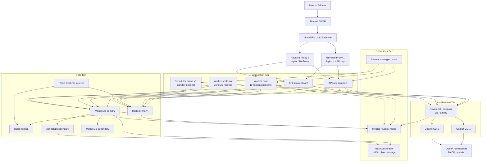

# InfoGather 地端 HA 版部署配置參考

日期：2026-06-04  
用途：供維運單位評估 InfoGather 地端高可用正式環境的部署拓撲、硬體資源、服務清單、HA 容錯與監控規劃。

## 1. 整體部署架構

地端 HA 版建議將 InfoGather 拆成入口層、應用層、LLM runtime 層、資料層與維運層。核心原則是讓 API、Worker、Copilot CLI Server、Redis 與 MongoDB 不在同一台主機上互相競爭資源，並避免單一節點故障造成整體 ingestion、assistant evaluation 或使用者介面停擺。

### 建議拓撲

### 服務角色與連線關係

| 角色 | 建議部署 | 主要用途 | 主要連線依賴 |
|---|---|---|---|
| Reverse Proxy / Load Balancer | 2 台或 2 instances，搭配 VIP / VRRP / 硬體 LB | 對外 HTTPS、TLS termination、路由到 API、健康檢查 | 對外網路、API app `/health` |
| API app | 至少 2 replicas | REST API、SSE、使用者與工作區權限、feeds/articles/assistants/briefs、Agent runtime API | MongoDB、Redis、Copilot CLI、Secrets |
| Worker | baseline 10 replicas，保留擴到 20 | feed/article/assistant/brief/announcement 背景工作 | Redis/BullMQ、MongoDB、Copilot CLI、外部資料來源 |
| Scheduler | active x1，standby optional | 到期 feed、brief 排程與 cron producer | MongoDB、Redis |
| Copilot CLI Server | 2 replicas 或 active/standby | LLM session orchestration、JSON-RPC / streaming、工具協調、BYOK provider 轉接 | API、Worker、外部 LLM provider、session state |
| Redis / BullMQ | Redis primary + replica，搭配 Sentinel quorum；或 Redis HA appliance | BullMQ queue、cache、refresh token ID state | API、Worker、Scheduler、監控與備份策略 |
| MongoDB | 3-node replica set | articles、assistantarticles、workspaces、users、briefs、notifications 等主資料 | API、Worker、Scheduler、備份 |
| Monitoring / Logging | 獨立維運節點或既有監控平台 | metrics、logs、alerts、dashboard、incident response | 所有 runtime、DB、Redis、CLI |
| Backup / Restore | 獨立 NAS、備份主機或物件儲存 | MongoDB snapshot/dump、設定備份、還原演練 | MongoDB、Redis 視策略、Secrets 設定 |
| Secrets Manager / Vault | 獨立或既有企業平台 | Mongo URI、Redis URL、JWT secrets、OAuth credentials、LLM API keys | API、Worker、Scheduler、Copilot CLI |

## 2. 硬體資源配置

以下規格以目前觀測到的 10 個 worker container、MongoDB 約 1.36 GiB physical size、MongoDB indexes 約 824.84 MiB、Redis current used memory 約 34.35 MiB、Redis peak 約 3.71 GiB，以及 Copilot CLI idle 約 294 MiB 作為基準。正式環境不應直接用 idle memory 推估，必須保留尖峰流量、queue backlog、LLM session concurrency、備份與 HA 容錯空間。

### 節點層級建議

| 節點類型 | 最低可行配置 | 建議正式配置 | 可擴充配置 | 配置依據 |
|---|---:|---:|---:|---|
| Reverse Proxy / LB 節點 x2 | 每台 2 vCPU / 4 GiB RAM | 每台 2 到 4 vCPU / 4 到 8 GiB RAM | 2 台以上，或導入硬體/虛擬 LB | HTTPS、SSE connection、TLS、健康檢查與故障切換 |
| App/Worker 節點 x3 | 每台 8 vCPU / 32 GiB RAM | 每台 8 到 12 vCPU / 32 到 64 GiB RAM | 增加第 4 台以上 worker 節點，或將 API 與 Worker 拆成不同 node pool | 10 workers baseline、API x2、scheduler、queue consumer 併發、rolling restart headroom |
| Copilot CLI 節點 x2 | 每台 1 到 2 vCPU / 2 GiB RAM | 每台 2 vCPU / 4 GiB RAM | 3 replicas，或拆成 API CLI pool / Worker CLI pool | session concurrency、streaming stability、LLM request rate、HA / affinity |
| MongoDB 節點 x3 | 每台 4 vCPU / 16 GiB RAM / 500 GB NVMe | 每台 4 到 8 vCPU / 16 到 32 GiB RAM / 1 TB NVMe | 增加 storage、提高 RAM、加入 read scaling；長期再評估 sharding | index working set、slow query、connections、備份與 replica set 容錯 |
| Redis HA 節點 x2 到 x3 | 每台 2 vCPU / 8 GiB RAM | 每台 2 到 4 vCPU / 8 到 16 GiB RAM | Redis Cluster 或更高 RAM；Sentinel quorum 至少 3 votes | BullMQ retention、queue backlog、failed jobs、cache、refresh token state |
| Monitoring / Logging 節點 | 2 vCPU / 8 GiB RAM | 4 vCPU / 16 GiB RAM | 依 log retention、metrics cardinality 擴充 storage | metrics、logs、dashboard、alert rules、incident analysis |
| Backup / Storage | 1 到 2 TB 可用容量 | 2 TB 以上，保留 7 到 14 天 | 異地備份、immutable backup、長期歸檔 | MongoDB daily snapshot/dump、restore drill、RPO/RTO |

### Runtime 服務資源建議

| 服務 | 最低可行配置 | 建議正式配置 | 可擴充配置 | 備註 |
|---|---:|---:|---:|---|
| API app | 2 replicas，每個 1 vCPU / 2 GiB RAM | 2 replicas，每個 2 vCPU / 4 GiB RAM | 3 replicas 以上 | API 層多為 I/O bound，但 SSE 與 Agent runtime 需保留 connection headroom |
| Worker | 10 replicas，每個 0.5 vCPU / 512 MiB 到 1 GiB RAM | 10 replicas，每個 1 vCPU / 1 GiB RAM | max 20 replicas；必要時拆 queue-specific workers | worker 數量應由 queue depth、job duration、LLM 429/5xx 共同決定 |
| Scheduler | 1 active，每個 0.5 vCPU / 512 MiB RAM | 1 active + 1 standby，每個 1 vCPU / 1 GiB RAM | active/passive，避免 active/active 重複 enqueue | scheduler 應維持 singleton，除非有明確分散式鎖與去重機制 |
| Copilot CLI Server | 2 replicas，每個 1 vCPU / 2 GiB RAM | 2 replicas，每個 2 vCPU / 4 GiB RAM | 3 replicas 或依 API/Worker 分流 | 不執行模型推論，但承擔 session orchestration、streaming 與工具協調 |
| Redis | 8 GiB RAM 起步 | 8 到 16 GiB RAM | 16 GiB 以上或 Redis Cluster | Redis current memory 很低，但 history peak 達 3.71 GiB，仍需保留 backlog 與 retention headroom |
| MongoDB | 16 GiB RAM 起步 | 16 到 32 GiB RAM | 視 index working set 與 slow query 擴充 | 目前資料不大，但 articles index 約 741 MiB，需預留成長與查詢 working set |

### 配置依據摘要

| 估算因素 | 對配置的影響 | 維運判斷方式 |
|---|---|---|
| 10 worker baseline | 決定 App/Worker 節點 CPU/RAM、Redis queue 壓力、MongoDB connections、Copilot CLI session 數 | 觀察 queue depth、job duration、active jobs、worker restart |
| queue depth / backlog | 決定 worker 是否擴到 20、Redis RAM 是否提高 | waiting 持續上升、prioritized jobs 堆積、job duration 變長 |
| LLM request rate | 決定 Copilot CLI replicas、connection affinity、LLM backoff/throttle | Copilot CLI session latency、LLM 429/5xx、timeout、cost per day |
| MongoDB working set | 決定 MongoDB RAM、IOPS、index tuning | slow query、index size、cache hit、connections、replication lag |
| Redis retention / failed jobs | 決定 Redis RAM 與 cleanup policy | Redis used memory、evictions、failed/completed job history、latency |
| HA 容錯需求 | 決定節點數、replica set、Sentinel quorum、LB/VIP | 是否可承受單一節點維護或故障、RPO/RTO 目標 |

## 3. 部署服務清單

| 服務 | 必要副本 | 用途 | 持久化需求 | 建議部署方式 | 是否可共用節點 |
|---|---:|---|---|---|---|
| Reverse Proxy / Nginx / HAProxy | 2 | HTTPS、反向代理、API health routing、SSE passthrough | 不需要；保留設定檔備份 | 獨立入口節點，搭配 VIP / VRRP 或硬體 LB | 可與 WAF/LB 共用，不建議與 DB 共用 |
| API app | 2 起 | REST API、SSE、Swagger optional、使用者流量、Agent API | 不需要本地持久化 | App/Worker 節點或獨立 app node pool | 可與 worker 共用 App/Worker 節點 |
| Worker | 10 baseline | queue consumers，處理 feed/article/assistant/brief/announcement | 不需要本地持久化 | App/Worker 節點，平均分散到 3 台以上 | 可與 API 共用，但需 resource limit |
| Scheduler | 1 active | cron producer，enqueue due feeds / briefs | 不需要本地持久化 | App/Worker 節點；standby 可同 image 預備 | 可共用，但必須避免多 active |
| Copilot CLI Server | 2 | LLM session orchestration、JSON-RPC / streaming、provider bridge | 建議保存 session state；active/active 需 affinity 或共享策略 | 優先獨立部署，透過 private endpoint 提供 API/Worker 使用 | 不建議與 MongoDB/Redis 共用；小型環境可與 app node 共用但需資源隔離 |
| MongoDB primary/secondary | 3 | 主資料庫 replica set | 必要；NVMe SSD，定期備份 | 獨立 DB 節點 | 不建議共用 |
| Redis primary/replica | 2 到 3 | BullMQ queue、cache、refresh token ID state | 視策略啟用 AOF/RDB；至少保留備份或重建程序 | 獨立 Redis 節點或 Redis HA appliance | 不建議與 API/Worker 共用正式資源 |
| Redis Sentinel | 3 votes | Redis failover quorum | 不需要大量 storage | 可部署於 Redis 節點或 App/Worker 節點 | 可共用，但需跨節點分散 |
| Monitoring | 1 起，建議 HA 或外部平台 | Prometheus/Grafana、logs、alerts、dashboard | 必要；依 retention 規劃 storage | 維運節點或既有監控平台 | 可與 logging 共用 |
| Log aggregation | 1 起，依流量擴充 | API/worker/DB/Redis/CLI logs | 必要；依 log retention 規劃 | 維運節點或既有 SIEM/ELK/Loki | 可與 monitoring 共用，正式大流量建議拆分 |
| Backup job / repository | 1 起 | MongoDB dump/snapshot、設定與 secrets metadata 備份、restore drill | 必要；獨立儲存與權限 | 獨立備份主機、NAS 或物件儲存 | 不建議與 primary DB 共用唯一磁碟 |
| Secrets Manager / Vault | 1 起，依企業標準 HA | 管理 Mongo/Redis/LLM/OAuth/JWT secrets | 必要 | 既有企業平台或獨立部署 | 可用既有平台；不建議把 secrets 放在 compose env 明文長期維護 |
| Bull Board / Queue dashboard | 1，可掛在 API 並加 basic auth | queue depth、failed jobs、runtime visibility | 不需要 | 僅內網或 VPN 開放 | 可掛 API，但 production 必須啟用認證 |

## 4. HA 與容錯設計

### API app

- 至少 2 replicas，放在不同 App/Worker 節點。
- Reverse Proxy 或 LB 以 `GET /health` 做 readiness check；異常時自動摘除。
- API 本身應維持 stateless，session、cache 與 queue state 交給 Redis/MongoDB。
- Rolling restart 時需提供 graceful shutdown，避免 SSE 與 DB/Redis connection 被硬切。

### Worker

- baseline 維持 10 replicas，平均分散於 3 台以上 App/Worker 節點。
- worker 是主要吞吐旋鈕；擴充應依 queue depth、job duration、LLM provider 429/5xx 與 Copilot CLI latency 判斷。
- 若特定 queue 長期積壓，可評估 queue-specific worker pools，而不是只盲目增加所有 worker。
- 停止或滾動更新時需保留 grace period，讓 active jobs 正常完成或回到 queue。

### Scheduler

- scheduler 建議維持 active x1，避免重複 enqueue cron jobs。
- 可準備 standby instance，但預設不 active；故障時由維運或平台切換。
- 若未來要 active/active，必須先確認分散式鎖、job idempotency 與重複排程去重策略。

### Copilot CLI Server

- 建議 2 replicas 或 active/standby，透過 private LB / internal endpoint 提供給 API 與 Worker。
- 若採 active/active，需驗證 connection affinity 或 session state 策略，避免 streaming session 中斷或狀態不一致。
- 若 LLM request rate 高，建議將 API chat traffic 與 worker evaluation traffic 拆成不同 CLI endpoint，降低互相影響。
- CLI 需納入 healthcheck、restart policy、session latency dashboard 與 error rate 告警。

### MongoDB

- 建議 3-node replica set，primary + 2 secondaries，分散於不同實體主機或虛擬化 failure domain。
- 寫入建議採 majority write concern；讀取預設走 primary，必要時再評估 read preference。
- 定期備份 primary 或 secondary，並固定做 restore drill。
- 監控 replication lag、oplog window、connections、slow query、disk usage 與 index growth。

### Redis / BullMQ

- 建議 Redis primary + replica，搭配至少 3 個 Sentinel votes；或採企業既有 Redis HA appliance。
- Redis 同時承載 BullMQ、cache 與 refresh token ID state，正式環境禁止使用 `FLUSHDB`、`FLUSHALL` 或 broad key deletion。
- BullMQ completed/failed history 必須透過 retention policy 與 BullMQ API 清理，不可直接刪 Redis key prefix。
- 是否啟用 AOF/RDB 需依 queue 可重建程度決定；即使 queue 可重建，也應保留 failure log 與 operational record。

### 主要單點故障與改善建議

| 風險 | 影響 | 改善建議 |
|---|---|---|
| 單一 Reverse Proxy / LB | 使用者無法進入系統 | 2 台 reverse proxy + VIP / VRRP，或硬體/虛擬 LB HA |
| API 單副本 | API deploy 或故障時服務中斷 | API x2 起，LB healthcheck 自動摘除異常節點 |
| Worker 集中於單一節點 | 背景處理停擺或 backlog 快速上升 | 10 workers 分散到 3 台以上節點，保留擴到 20 的容量 |
| Scheduler 無 standby | 到期 feed/brief 無法 enqueue | standby 預備與明確切換程序；避免多 active |
| Copilot CLI 單點 | Agent chat、article extraction、assistant evaluation 受影響 | CLI x2、private LB、session affinity 或 active/standby |
| MongoDB 單機 | 主資料不可用或資料遺失風險 | 3-node replica set、daily backup、restore drill |
| Redis 單機 | queue/cache/token state 受影響 | primary/replica + Sentinel，保留 failover runbook |
| Backup 與 DB 共用唯一 storage | DB 主機故障時備份也不可用 | 獨立 NAS/備份主機/異地保存，定期還原演練 |
| 外部 LLM provider 不穩 | LLM jobs timeout、429、成本或延遲上升 | backoff/throttle、rate limit dashboard、provider fallback 評估 |

## 5. 維運與監控建議

正式環境不應只依據閒置資源估算。現況 worker 與 Copilot CLI idle memory 看起來不高，但 ingestion 尖峰、assistant evaluation、queue backlog、LLM request rate 與 HA failover 都會放大資源需求。維運監控應以「使用者體驗、queue 吞吐、資料層健康、LLM runtime 穩定性」作為主要判斷依據。

### 關鍵監控指標與建議告警

| 類別 | 指標 | 建議告警門檻 | 維運意義 |
|---|---|---|---|
| Node | CPU、RAM、load average、disk usage、disk I/O wait | CPU > 70% 持續 15 分鐘、RAM > 80%、disk > 70%、I/O wait 持續升高 | 判斷節點是否需要擴容或分流 |
| API | p95 latency、5xx rate、SSE disconnect、request rate | p95 > 1s、5xx > 1%、SSE disconnect 異常升高 | 判斷 API replicas、DB/Redis/CLI 依賴是否異常 |
| Worker | queue depth、active jobs、job duration、failed rate、restart count | waiting > 1,000 或持續上升、failed rate > 5%、job duration p95 明顯升高 | 判斷是否需擴 worker、調整 queue 或處理外部瓶頸 |
| BullMQ | waiting/active/delayed/prioritized/completed/failed counts | prioritized jobs 長時間不降、failed jobs 快速累積 | 判斷 queue 是否積壓或 processor 是否異常 |
| Redis | used memory、memory fragmentation、evictions、ops/sec、latency、replication health | memory > 75%、evictions > 0、replica lag、latency spike | 判斷 Redis RAM、retention、failover 是否健康 |
| MongoDB | slow query、connections、index size、working set、replication lag、oplog window、disk usage | slow query 增加、connections > 80%、replication lag 上升、disk > 70% | 判斷 query/index、RAM、IOPS 與備份風險 |
| Copilot CLI | session latency、active sessions、error rate、restart count、connection count | p95 latency > 2s、error > 1%、restart、connection spike | 判斷 CLI replicas、affinity、LLM runtime 是否不足 |
| LLM provider | latency、429/5xx、timeout、cost per day | 出現 429、5xx 升高、每日成本超標 | 判斷是否需 backoff、throttle、分流或調整 provider 配額 |
| Backup | backup success、backup duration、restore drill result、RPO/RTO | backup failed、restore drill 未通過、duration 異常拉長 | 確認資料保護是否可用，不只看排程是否存在 |
| Security | login failures、admin audit、secret rotation、TLS cert expiry | 異常登入、權限異動、憑證即將過期 | 降低帳號、憑證與維運風險 |

### 維運建議

1. 建立 baseline dashboard：至少包含 API latency、queue depth、job duration、Redis memory、Mongo slow query、Copilot CLI latency 與 LLM 429/5xx。
2. 建立容量決策門檻：worker 擴充以 queue depth 與 job duration 為主，不只看 CPU。
3. 建立 failover runbook：Reverse Proxy、API、Worker、Copilot CLI、Redis、MongoDB 都需有故障切換與回復流程。
4. 建立 backup / restore drill：MongoDB 至少每日備份，並定期演練還原；沒有演練就不能視為已達成 RPO/RTO。
5. 建立 Redis cleanup 原則：BullMQ history cleanup 必須使用 BullMQ API 與 retention policy，避免 Redis-wide deletion。
6. 建立 Copilot CLI dashboard：追蹤 session latency、active sessions、error rate、restart 與 LLM provider error。
7. 建立部署 grace period：API、Worker、Scheduler rolling restart 時需保留足夠時間關閉 MongoDB、Redis 與 active jobs。
8. 建立容量複核週期：正式上線後每 2 到 4 週複核資料成長、index size、queue backlog、LLM 成本與 node headroom。

## 6. 建議落地順序

| 階段 | 工作項目 | 完成判斷 |
|---|---|---|
| 1. 基礎設施準備 | 建立 LB/Reverse Proxy、App/Worker 節點、MongoDB RS、Redis HA、Copilot CLI 節點、監控與備份儲存 | 所有節點可互通，private network 與 firewall policy 完成 |
| 2. Runtime 部署 | 部署 API x2、Worker x10、Scheduler x1、Copilot CLI x2，設定 `COPILOT_CLI_URL` private endpoint | API `/health` 正常，worker 可消化 queue，scheduler 無重複 enqueue |
| 3. 資料與 queue 驗證 | 驗證 MongoDB replica set、Redis failover、BullMQ retention、queue dashboard | replica/failover 正常，Redis memory 與 queue counts 可觀測 |
| 4. 壓測與瓶頸確認 | 執行 ingestion、article processing、assistant evaluation 壓測 | queue depth 可回落，job duration 可接受，CLI/LLM 無大量 timeout/429 |
| 5. 備份與 DR 演練 | 執行 MongoDB restore drill、Redis recovery procedure、服務節點故障演練 | RPO/RTO 可被驗證，維運 runbook 可操作 |
| 6. 正式切換 | DNS/LB 切換，開啟正式監控與告警 | 服務穩定，告警可用，容量 headroom 符合預期 |

## 7. 維運評估結論

地端 HA 版建議以 `App/Worker 節點 x3 + Copilot CLI x2 + MongoDB replica set x3 + Redis HA x2-3 + Reverse Proxy/LB x2 + 獨立監控/備份` 作為正式規劃基準。

最低可行部署可以先讓 API 與 Worker 共用 App/Worker 節點，但 MongoDB、Redis、Copilot CLI 與入口層應盡量獨立，避免同機資源競爭與單點故障。正式容量調整不應只看目前 idle CPU/RAM，而應依 queue depth、job duration、MongoDB working set、Redis memory、Copilot CLI session latency、LLM provider 429/5xx 與 HA failover 測試結果共同判斷。