# InfoGather 正式環境資源與系統架構提案

日期：2026-06-02  
版本：v1.6  
目的：依據目前資料量、Docker worker 併發、Copilot CLI server 依賴與實機資源觀測，提出正式環境的地端與雲端系統架構、硬體規格、擴充策略與導入路線。

## 簡報大綱

1. 執行摘要與正式環境建置目標
2. 專案技術堆疊與系統邊界概覽
3. 現行環境盤點與容量基準
4. 平台資料規模現況
5. 資料成長趨勢與負載來源分析
6. 背景處理流程與 Worker 併發模型
7. Copilot CLI Server 與 LLM Runtime 架構依賴
8. 正式環境資源估算原則
9. 地端正式環境目標架構
10. 地端硬體資源配置建議
11. 地端部署級距與高可用策略
12. 雲端正式環境目標架構
13. 雲端服務選型與資源配置建議
14. 安全控管、備份與災難復原策略
15. 可觀測性、告警與擴充機制
16. 成本最佳化與工程治理項目
17. 導入時程與決策建議

---

## 1. 執行摘要與正式環境建置目標

### 投影片重點

- InfoGather 目前已具備正式化條件，但資源提案必須以 10 個 worker container 為基準，而不是單一 worker。
- 現有資料量不大：MongoDB data + index 約 1.36 GiB；Redis/BullMQ used memory 約 34.35 MiB，retention 已納入容量控管。
- 目前主機為 8 vCPU / 15 GiB RAM，可支撐開發或低流量環境；正式環境建議至少提高到 16 vCPU / 64 GiB，若 Copilot CLI、MongoDB、Redis 與 10 workers 全部同機，保守規格建議 24 vCPU / 64 GiB。
- Copilot CLI server 是 API 與 worker 共用的外部 LLM runtime endpoint，目前閒置約 294 MiB RAM；正式環境需納入獨立服務與 HA 規劃。
- BullMQ completed/failed job retention 已納入容量控管，正式環境需持續監控 Redis memory、queue depth 與 failed rate。

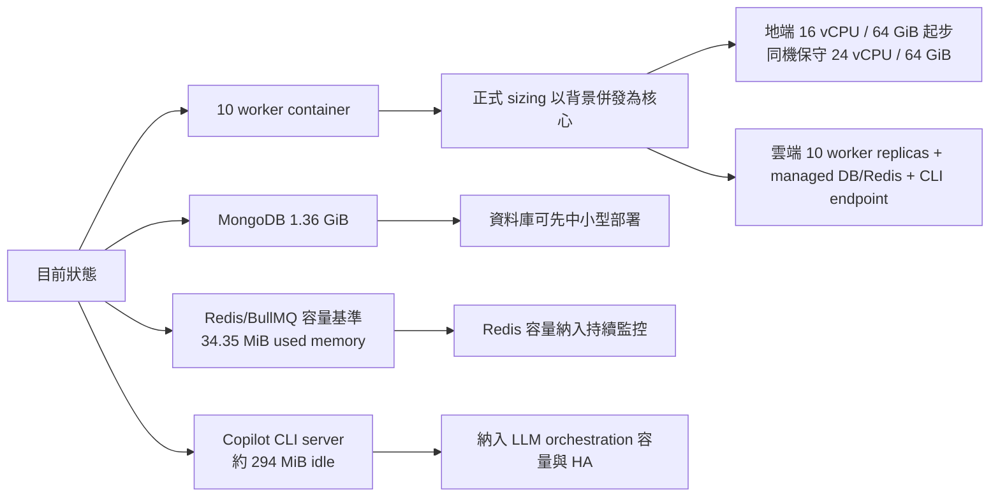

### 講稿內容

本頁先說明本次評估的核心結論。InfoGather 目前已具備進入正式環境規劃的基礎，但資源估算不能只用目前主機規格線性放大，而必須把實際執行模式納入考量。現在系統已經以 10 個 worker container 處理背景工作，同時依賴 MongoDB、Redis/BullMQ 與 Copilot CLI server，因此正式環境容量應以背景併發、LLM runtime、Redis 記憶體與 MongoDB 索引共同評估。

目前 MongoDB 資料量仍屬中小型；Redis/BullMQ 目前 used memory 約 34.35 MiB，正式環境 sizing 重點是持續監控 Redis memory、queue depth、failed rate 與 retention 設定。結論上，地端正式環境至少建議 16 vCPU / 64 GiB；若 Copilot CLI、MongoDB、Redis 與 10 個 workers 全部同機，保守規格應抓到 24 vCPU / 64 GiB。若採雲端方案，則建議使用 managed MongoDB、managed Redis、containerized workers，以及獨立的 Copilot CLI private endpoint。

---

## 2. 專案技術堆疊與系統邊界概覽

### 投影片重點

本頁建立後續容量估算與架構提案的共同技術脈絡。

| 層級 | 技術 / 元件 | 正式環境定位 |
|---|---|---|
| Frontend | Angular 21 SPA | 使用者介面與前端路由，靜態資產可由 Nginx、CDN 或 static hosting 提供 |
| Backend | NestJS 11 API | REST API、SSE、工作區權限、feeds、articles、assistants、briefs 與 agent runtime |
| Monorepo | Nx + TypeScript | 前後端一致建置、測試與部署管理 |
| Database | MongoDB + Mongoose | 儲存文章、助手評估、工作區、通知、briefs 與使用者狀態 |
| Queue | Redis + BullMQ | 承載 feed、article、assistant、brief、announcement 等背景工作 |
| Background runtime | Scheduler + worker pool | 排程與背景處理；正式 sizing 以 10 個 worker container 為基準 |
| LLM runtime | Copilot CLI server + OpenAI-compatible BYOK provider | Agent chat、文章萃取、摘要與助手評估的 LLM control plane |
| Deployment | Docker containers | 可落地於地端 VM/HA 架構或雲端 container platform |

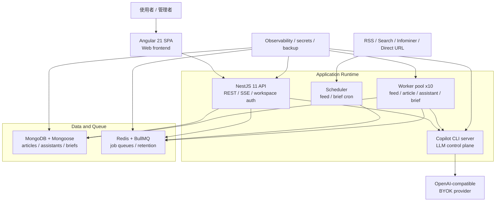

### 講稿內容

這一頁先建立整份提案的共同技術語境。InfoGather 是 Nx monorepo，前端是 Angular 21 SPA，後端是 NestJS 11 API；資料層以 MongoDB 與 Mongoose 儲存文章、助手評估、briefs、通知與使用者狀態；背景工作則由 Redis 與 BullMQ 承載，透過 scheduler 與 worker pool 處理 feed 抓取、文章處理、助手評估與 brief 產生。

LLM 相關流程不是直接嵌在單一 API process 裡，而是透過 Copilot CLI server 作為外部 runtime endpoint，負責 Agent chat、文章萃取、摘要與助手評估所需的 LLM session orchestration，並轉接 OpenAI-compatible BYOK provider。這也是為什麼後續 sizing 不只看 Web/API 和 MongoDB，而要一起評估 worker pool、Redis queue、Copilot CLI server、MongoDB index working set，以及外部 LLM/API rate limit。

部署上，這套系統已經天然容器化，因此可以落地在地端 VM、地端 HA 架構，或雲端 container platform。地端與雲端的差異主要在網路隔離、資料服務、備份、高可用與監控工具的實作方式；核心應用邊界與容量瓶頸是一致的。

---

## 3. 現行環境盤點與容量基準

### 投影片重點

| 項目 | 目前觀測 |
|---|---:|
| 主機 CPU | 8 vCPU |
| 主機 RAM | 15 GiB total / 約 3.4 GiB available |
| CPU 型號 | Intel Xeon Gold 6444Y |
| InfoGather app | 1 container，約 104 MiB RAM |
| InfoGather scheduler | 1 container，約 42 MiB RAM |
| InfoGather worker | 10 containers，單個約 88 到 116 MiB RAM |
| Copilot CLI server | 1 container，約 294 MiB RAM |
| MongoDB container | 約 1.53 GiB RAM |
| Redis container | 約 156.7 MiB RAM；Redis used memory 約 34.35 MiB |

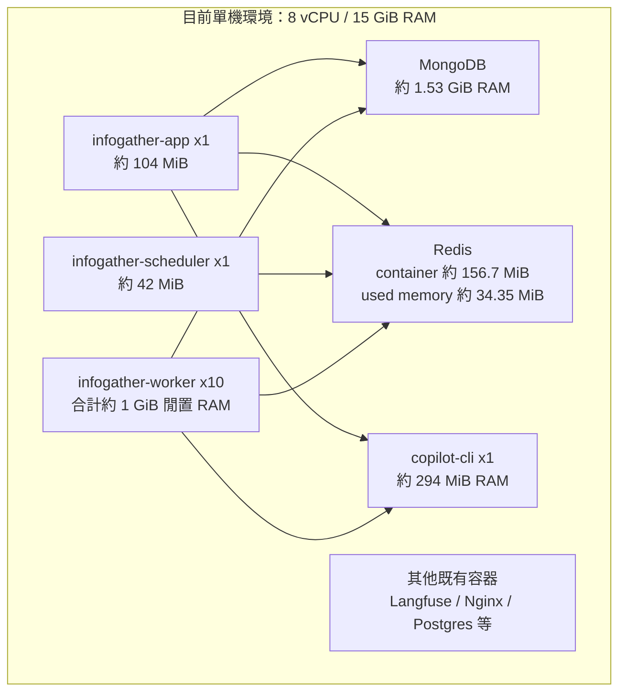

### 講稿內容

這一頁是目前環境的容量基準。現有主機為 8 vCPU、15 GiB RAM，已經同時承載 InfoGather app、scheduler、10 個 worker、MongoDB、Redis、Copilot CLI server，以及其他既有服務。從閒置資源來看，單一 worker 只使用約 88 到 116 MiB RAM，10 個 worker 合計約 1 GiB；Copilot CLI server 目前約 294 MiB；MongoDB 約 1.53 GiB；Redis container 約 156.7 MiB，Redis 自身 used memory 約 34.35 MiB。

需要特別注意的是，這些數字是當下取樣，不代表尖峰容量。worker 在閒置時很輕，但一旦排程同時觸發 feed 抓取、文章萃取與助手評估，10 個 worker 會同步推高 Redis、MongoDB、Copilot CLI server 與外部 LLM/API 的壓力。因此正式環境不能只依照平均記憶體使用量估算，而要保留足夠尖峰容量與服務隔離空間。

---

## 4. 平台資料規模現況

### 投影片重點

| 資料類型 | 數量 / 用量 |
|---|---:|
| MongoDB collections | 29 |
| MongoDB documents | 1,113,082 |
| MongoDB logical data | 約 934.84 MiB |
| MongoDB storage + indexes | 約 1.36 GiB |
| 使用者 | 172 |
| 工作區 | 29 |
| 資料來源 feeds | 176，其中 159 active |
| 資訊助手 assistants | 41，其中 38 active |
| articles | 246,876 |
| assistantarticles | 859,775 |
| notifications | 2,662 |

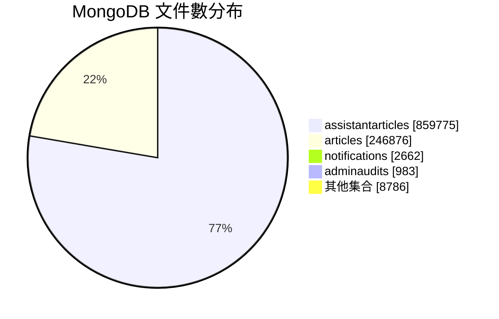

### 講稿內容

這一頁呈現目前 MongoDB 的資料規模。整體共有 29 個 collections、約 111 萬筆文件，實際資料加索引約 1.36 GiB。以正式環境資料庫來說，這個規模還不算大，短期不需要大型資料庫叢集才能運作。

不過資料分布很集中，主要落在 `articles` 與 `assistantarticles`。其中 `assistantarticles` 約 86 萬筆，代表助手對文章的評估紀錄；`articles` 約 24.7 萬筆，是平台內容檢索與呈現的核心資料。值得注意的是，MongoDB index 約 825 MiB，其中 articles index 約 741 MiB，這會影響資料庫 working set 與查詢延遲，因此正式環境 RAM 配置要以索引能穩定留在記憶體為目標。

---

## 5. 資料成長趨勢與負載來源分析

### 投影片重點

| 指標 | 近 1 天 | 近 7 天 | 近 30 天 |
|---|---:|---:|---:|
| 新增 articles | 3,163 | 37,432 | 103,698 |
| 新增 assistantarticles | 8,490 | 132,961 | 418,290 |
| 新增 users | - | 11 | 40 |

近 7 天文章來源分布：

| 來源 | 新增文章數 |
|---|---:|
| RSS | 31,035 |
| Infominer | 5,803 |
| Search | 594 |

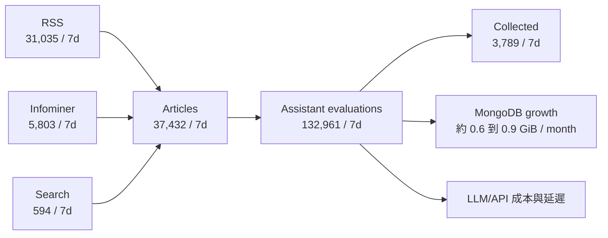

### 講稿內容

這一頁說明資料成長速度與主要壓力來源。近 30 天新增約 10.4 萬篇文章、41.8 萬筆助手文章評估；近 7 天則新增約 3.7 萬篇文章、13.3 萬筆助手評估。這代表平台真正的負載不是只有文章入庫，而是每篇文章後續會觸發多個助手規則評估。

從來源來看，近 7 天新增文章主要來自 RSS，其次是 Infominer，Search 目前占比較低。以目前比例估算，每篇文章平均會產生約 3.55 筆助手評估，因此 worker 併發、Copilot CLI session、LLM provider rate limit 與成本，會比單純文章數更敏感。正式環境應把 assistant evaluation 視為主要成長負載來規劃。

---

## 6. 背景處理流程與 Worker 併發模型

### 投影片重點

- `scheduler` 負責排程到期 feed。
- `feed` queue 抓取 RSS/Search/Infominer 文章。
- `article` queue 進行去重、萃取、摘要與入庫。
- `assistant` queue 對文章進行助手規則評估。
- 目前 10 個 worker container 都載入 queue processors，等於所有背景 queue 都有 10 個消費者競爭處理。

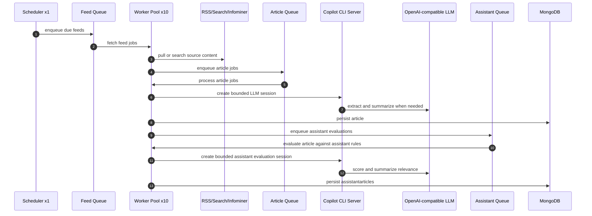

### 講稿內容

這一頁用流程圖說明目前的背景處理模型。scheduler 會先找出到期的 feed，將工作送進 feed queue；worker 從來源抓取資料後，會把待處理文章送入 article queue。article processor 會進行去重、必要時透過 Copilot CLI 建立 LLM session 進行萃取與摘要，最後把文章寫入 MongoDB。

文章入庫後，系統會依據文章所屬來源找出相關助手，將助手評估工作送入 assistant queue。這些工作同樣由 worker pool 處理，透過 Copilot CLI 與 LLM provider 進行相關性評分、摘要與理由產生，最後寫入 `assistantarticles`。因此，10 個 worker 代表的是吞吐量設計，不只是備援數量；正式環境需要同步規劃 Redis queue、MongoDB connection pool、Copilot CLI session capacity、外部 API rate limit 與 LLM concurrency control。

---

## 7. Copilot CLI Server 與 LLM Runtime 架構依賴

### 投影片重點

- API app 與 worker 都透過 `COPILOT_CLI_URL` 連到外部 Copilot CLI server。
- Copilot CLI server 負責 Copilot SDK session、JSON-RPC / streaming、工具呼叫協調、permission handler 與 OpenAI-compatible provider 轉接。
- 它不執行模型推論本身，但會承擔高併發 session orchestration；10 worker 會放大 CLI session 數與 LLM provider request rate。
- 目前容器閒置約 294 MiB RAM、CPU 幾乎為 0；正式環境不應用閒置值估算，需保留 session 尖峰與 HA 空間。
- 建議把 Copilot CLI server 視為獨立 runtime service：地端至少 2 vCPU / 2 到 4 GiB RAM；雲端至少 1 到 2 replicas，每個 1 到 2 vCPU / 1 到 2 GiB RAM。

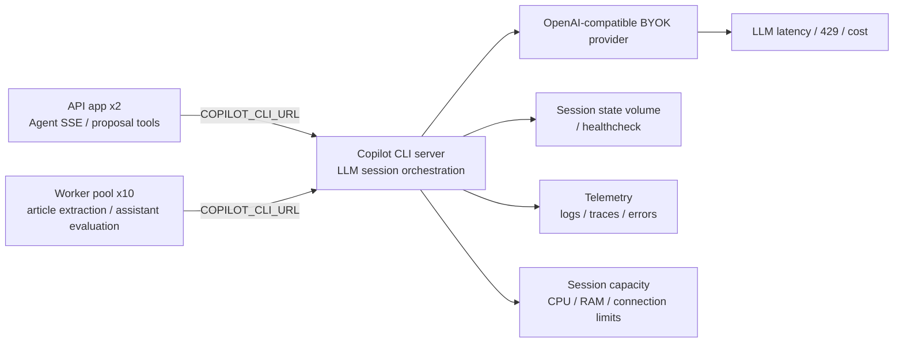

### 講稿內容

這一頁補上 Copilot CLI server 的正式定位。Copilot CLI server 是 API app 與 worker 共用的 LLM runtime endpoint，應用服務會透過 `COPILOT_CLI_URL` 連到它。它本身不執行模型推論，但會負責 Copilot SDK session、JSON-RPC / streaming、工具呼叫協調、permission handler，以及轉接 OpenAI-compatible BYOK provider。

因此它不是單純的輔助容器，而是 LLM runtime 的控制面。若 Copilot CLI server 不可用，Agent chat、article extraction 與 assistant evaluation 都會受到影響。正式環境建議將它視為獨立 runtime service，使用 private endpoint，並預留至少 2 vCPU / 2 到 4 GiB RAM。若採高可用設計，需驗證 session affinity 或採 active/standby，避免水平擴充後出現 streaming session 中斷或狀態不一致。

---

## 8. 正式環境資源估算原則

### 投影片重點

正式 sizing 不只看資料庫大小，而是綜合以下因子：

| 因子 | 對資源的影響 |
|---|---|
| 10 worker container | 提高背景併發與外部 API 壓力 |
| Copilot CLI server | 決定 LLM session orchestration、Agent chat 與 worker LLM 呼叫穩定性 |
| MongoDB indexes | 決定 DB RAM 與查詢延遲 |
| Redis queue retention 與 backlog | 決定 Redis RAM 與成本 |
| Article growth | 決定 MongoDB storage 與備份容量 |
| Assistant evaluation | 決定 LLM 成本、worker 吞吐量與 queue 深度 |
| 備份與 HA | 決定磁碟、網路與節點數 |

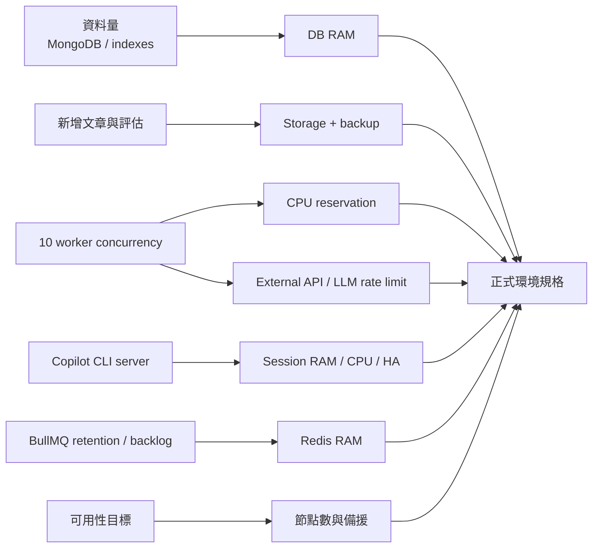

### 講稿內容

這一頁整理正式環境資源估算的原則。InfoGather 的正式 sizing 不應只看 MongoDB 目前大小，因為資料庫本體目前仍不大；真正需要一起評估的是 10 個 worker 的背景併發、Copilot CLI server 的 session orchestration、Redis queue retention 與 backlog、MongoDB index working set，以及備份與高可用要求。

建議採用「資源預留加指標驅動擴充」的方式。初期 worker 可以維持 desired 10 replicas，但後續是否擴到 20，不應只看 CPU，而應看 queue depth、job duration、Copilot CLI session latency、LLM provider 429 / 5xx、Redis memory、MongoDB slow queries 與 working set。這樣可以避免過度採購，也能在真正瓶頸出現時精準擴充。

---

## 9. 地端正式環境目標架構

### 投影片重點

地端正式環境建議拆成四層：入口層、應用層、資料層、觀測與備份層。

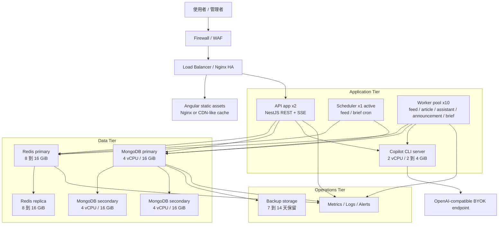

### 講稿內容

這一頁是地端正式環境的目標架構。建議將系統拆成入口層、應用層、資料層，以及觀測與備份層。入口層由 Firewall、WAF、Load Balancer 或 Nginx HA 承接外部流量；應用層包含 API app、scheduler、worker pool 與 Copilot CLI server；資料層則包含 Redis HA 與 MongoDB replica set。

這樣拆分的目的，是避免 10 個 worker、Redis、MongoDB 與 Copilot CLI server 在同一台主機上互相競爭資源。API 與 worker 會同時連接 Redis、MongoDB 與 Copilot CLI；Copilot CLI 再連到 OpenAI-compatible BYOK endpoint。若正式環境需要高可用，資料層與 LLM runtime endpoint 都應具備獨立資源、健康檢查、監控與替換策略，避免任何單一服務故障造成整體 ingestion 或助手評估停擺。

---

## 10. 地端硬體資源配置建議

### 投影片重點

### 單機正式起步，成本優先

| 元件 | 建議規格 |
|---|---:|
| 主機，最低可用 | 16 vCPU / 64 GiB RAM |
| 主機，同機保守 | 24 vCPU / 64 GiB RAM，適用 Copilot CLI、MongoDB、Redis 與 10 workers 全部同機 |
| 磁碟 | 1 TB NVMe SSD |
| Worker | 10 containers，每個預留 0.5 到 1 vCPU / 512 MiB 到 1 GiB |
| Copilot CLI server | 預留 2 vCPU / 2 到 4 GiB RAM；若高可用則 2 instances |
| Redis | 預留 8 到 16 GiB RAM |
| MongoDB | 預留 8 到 16 GiB RAM |
| 備份 | 1 到 2 TB 外部或 NAS 備份空間 |

### 高可用正式版，建議目標

| 層級 | 建議規格 |
|---|---|
| App/Worker 節點 | 3 台，每台 8 vCPU / 32 GiB RAM |
| Copilot CLI server | 2 台或 2 replicas，每個 1 到 2 vCPU / 2 GiB RAM，透過 private endpoint 連線 |
| MongoDB replica set | 3 台，每台 4 vCPU / 16 GiB RAM / 500 GB NVMe SSD |
| Redis HA | 2 到 3 台，每台 2 到 4 vCPU / 8 到 16 GiB RAM |
| Load balancer | 2 台小型 VM 或硬體/虛擬 LB |
| Backup | 每日至少一次，保留 7 到 14 天 |

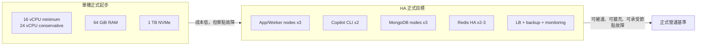

### 講稿內容

這一頁給出地端硬體資源建議。若採成本優先的單機正式起步方案，最低建議為 16 vCPU / 64 GiB RAM / 1 TB NVMe SSD。這個規格可承載目前資料量與 10 worker 的初始運行，但仍需接受單點故障風險。

如果 Copilot CLI server、MongoDB、Redis 與 10 個 workers 全部同機，保守建議提高到 24 vCPU / 64 GiB。這是因為 Copilot CLI 雖然目前閒置約 294 MiB，但尖峰時會承擔 session orchestration；Redis 需要預留 queue backlog、failed jobs 與 retention 安全餘裕；MongoDB 也需要保留索引 working set。若採高可用正式版，建議使用 3 台 App/Worker 節點、2 個 Copilot CLI instances、3 台 MongoDB replica set，以及 2 到 3 台 Redis HA 節點，讓服務可以維護、替換與水平擴充。

---

## 11. 地端部署級距與高可用策略

### 投影片重點

| 級距 | 適用情境 | 優點 | 風險 |
|---|---|---|---|
| 單機增強版 | 內部正式、低成本 | 建置快、成本低 | 主機故障即中斷 |
| 雙層拆分版 | API/worker/Copilot CLI 與 DB/Redis 分離 | 降低資源互搶 | DB/Redis 與 CLI endpoint 仍需備援 |
| HA 版 | 對外正式營運 | 可維護、可擴充 | 成本與維運複雜度較高 |

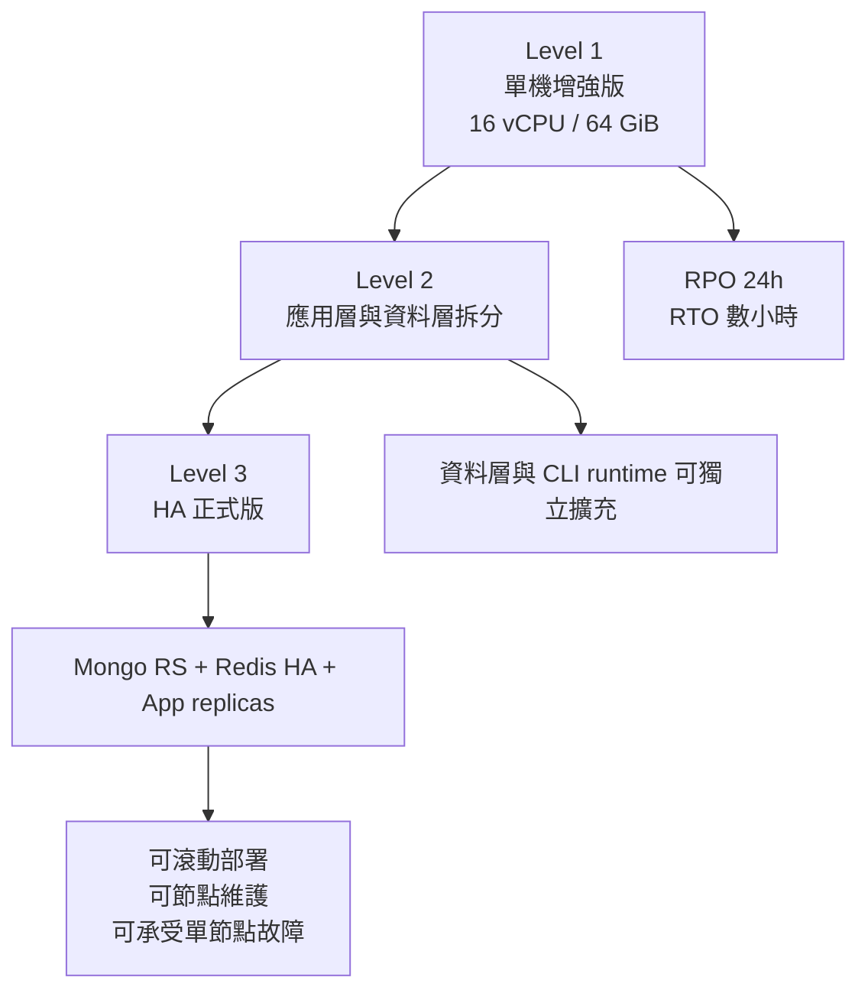

### 講稿內容

這一頁將地端部署分成三個級距。Level 1 是單機增強版，適合內部正式或成本優先情境，優點是建置快、成本低，但缺點是主機故障就會造成服務中斷。Level 2 將 API、worker、Copilot CLI 與資料層拆分，可以降低資源互搶，也讓資料層與 LLM runtime endpoint 可以獨立擴充。

若系統已經承載對外服務、跨部門關鍵流程，或需要明確 SLA，建議目標應放在 Level 3。Level 3 包含 MongoDB replica set、Redis HA、App/Worker replicas、Copilot CLI endpoint 備援與 Load Balancer。這個級距成本較高，但能支援滾動部署、節點維護與單節點故障承受能力，是較完整的正式營運架構。

---

## 12. 雲端正式環境目標架構

### 投影片重點

雲端建議採 managed data services，應用層容器化，worker 以 10 replicas 為 desired count。

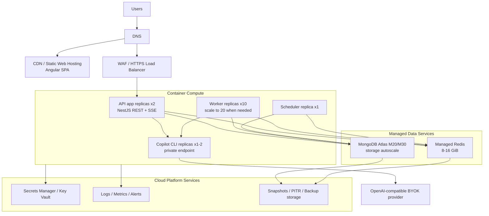

### 講稿內容

這一頁是雲端正式環境的目標架構。雲端方案建議把 Web 前端放在 Static Hosting 與 CDN，API 由 HTTPS Load Balancer 或 WAF 對外提供服務，應用層則以 container compute 執行 API app、scheduler、worker replicas 與 Copilot CLI replicas。

資料層建議採 managed services：MongoDB 使用 Atlas M20 或 M30 起步，Redis 使用 managed Redis 8 到 16 GiB。Copilot CLI server 則應作為 private endpoint 部署，只允許 API 與 worker 連線。雲端方案的主要價值，是把 MongoDB、Redis、備份、監控與部分高可用責任交給成熟平台，同時讓 worker pool 可依 queue depth 水平擴充。

---

## 13. 雲端服務選型與資源配置建議

### 投影片重點

| 元件 | 建議規格 |
|---|---|
| Web | Static hosting + CDN |
| API app | 2 replicas，每個 1 到 2 vCPU / 2 到 4 GiB RAM |
| Worker | desired 10 replicas，每個 0.5 到 1 vCPU / 512 MiB 到 1 GiB RAM |
| Scheduler | 1 replica，0.5 到 1 vCPU / 512 MiB 到 1 GiB RAM |
| Copilot CLI server | 1 到 2 replicas，每個 1 到 2 vCPU / 1 到 2 GiB RAM；高可用需 private LB / connection affinity |
| MongoDB | Atlas M20 起步；正式穩定或成長後升 M30 |
| Redis | 8 GiB 起步；若 retention 失效、尖峰 backlog 或需更高安全餘裕，再提高到 16 GiB |
| Backup | MongoDB daily snapshots + PITR；Redis 依 queue 可重建程度決定 |

| 類別 | AWS | Azure | GCP |
|---|---|---|---|
| Container | ECS/Fargate 或 EKS | Container Apps 或 AKS | Cloud Run 或 GKE |
| CDN/WAF | CloudFront + WAF | Front Door + WAF | Cloud CDN + Cloud Armor |
| Redis | ElastiCache Redis | Azure Cache for Redis | Memorystore for Redis |
| MongoDB | MongoDB Atlas on AWS | MongoDB Atlas on Azure | MongoDB Atlas on GCP |
| Secrets | Secrets Manager | Key Vault | Secret Manager |
| Observability | CloudWatch | Azure Monitor | Cloud Monitoring |

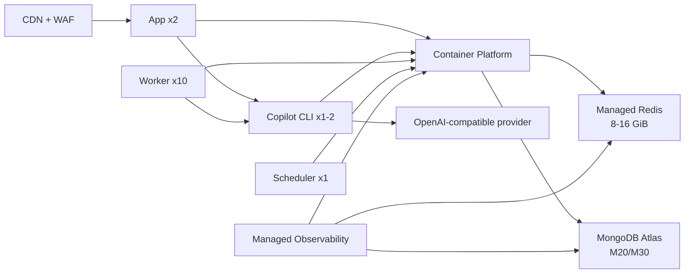

### 講稿內容

這一頁整理雲端服務選型與資源配置。Web 層建議使用 Static Hosting 搭配 CDN；API app 維持 2 個 replicas；worker desired count 以目前實際使用的 10 replicas 為基準，必要時可依 queue depth 擴充到 20；scheduler 則維持單一 replica，避免重複排程。

資料服務方面，MongoDB 建議以 Atlas M20 起步，正式穩定或資料成長後升到 M30；Redis 在目前 retention 已納入控管的狀態下，建議 8 GiB 起步，若後續出現尖峰 backlog、失敗工作快速累積或安全餘裕不足，再提高到 16 GiB。Copilot CLI server 建議部署 1 到 2 replicas，並透過 private LB 或 private endpoint 提供給 API 與 worker。第一階段不建議把 MongoDB 換成相容層資料庫，因為系統目前使用 Mongoose 與 MongoDB query/index 語意；Atlas 是遷移風險最低的雲端路徑。同樣地，正式環境也不建議讓 SDK 在 app 或 worker 內自行 spawn Copilot CLI，應以明確的 `COPILOT_CLI_URL` 管理。

---

## 14. 安全控管、備份與災難復原策略

### 投影片重點

以下是地端與雲端都應採用的正式環境共同控制原則；差異在實作工具與責任分工。

| 面向 | 建議 |
|---|---|
| 網路 | Web/API 對外；MongoDB/Redis 僅允許 private network / internal VLAN 存取 |
| Copilot CLI | 僅 private endpoint / internal service；只允許 API/worker 連線 |
| 憑證 | TLS everywhere；秘密值集中於 secrets manager / vault |
| 身分權限 | 最小權限、分角色帳號、資料庫帳號分 app/backup/admin |
| 備份 | MongoDB daily snapshot / dump + restore drill |
| RPO/RTO | 起步 RPO 24h / RTO 4h；正式 HA 可降到 RPO 1h / RTO 1h |
| 稽核 | admin audit、登入、資料異動與 queue failure 保留 |

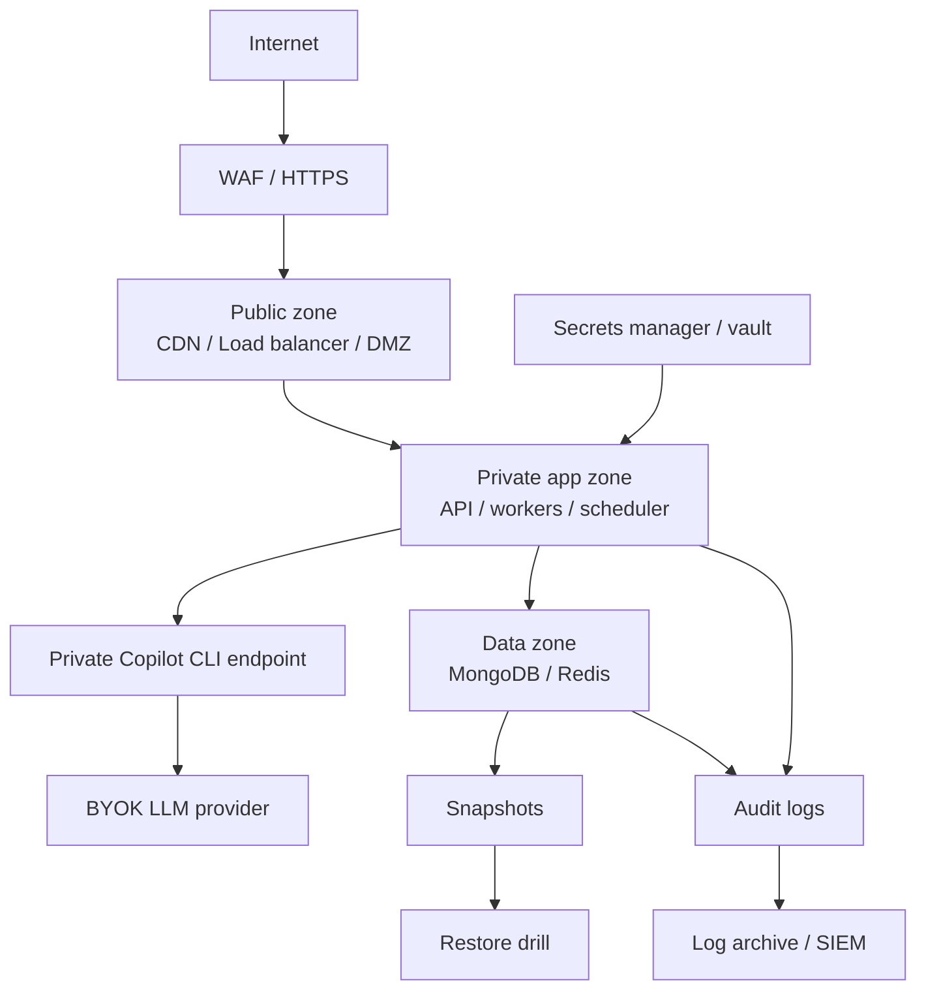

### 講稿內容

這一頁說明正式環境的安全與災難復原要求，這些要求同時適用地端與雲端。差異不在原則，而在實作方式：雲端可以用 VPC / subnet、managed WAF、Secrets Manager 或 Key Vault；地端則可用防火牆、DMZ、內部 VLAN、反向代理、Vault 或既有密碼管理系統來達成相同隔離。對外只應暴露 Web、API 或 Load Balancer，MongoDB、Redis 與 Copilot CLI endpoint 都應放在 private network，只允許 API、worker 與必要的維運節點連線。秘密值如 Mongo URI、Redis URL、OpenAI API key、Microsoft OAuth credentials，應集中管理，而不是直接散落在部署腳本中。

備份策略方面，MongoDB 應至少每日 snapshot 或 dump，雲端可採 managed snapshot / PITR，地端則需規劃外部 NAS、備份主機或異地保存。Redis 是否需要持久化，取決於 queue 是否可重建，但至少要有 queue failure 與重要 operational log 的保留策略。更重要的是，備份不是只有排程成功，還必須定期做 restore drill，確認 RPO 與 RTO 真的達成。若沒有還原演練，備份策略在正式事故中仍然是不確定的。

---

## 15. 可觀測性、告警與擴充機制

### 投影片重點

以下監控指標同時適用地端與雲端；差異在雲端較容易接 managed metrics 與 autoscaling，地端則需自行建置監控堆疊與擴充流程。

| 類別 | 指標 | 建議告警 |
|---|---|---|
| API | p95 latency、5xx rate、SSE disconnects | p95 > 1s 或 5xx > 1% |
| Worker | queue depth、job duration、failed rate | waiting > 1,000 或 failed rate > 5% |
| Copilot CLI | session latency、active sessions、error rate、container restart | p95 > 2s、error > 1% 或 restart |
| Redis | memory、evictions、ops/sec、latency | memory > 75% 或 evictions > 0 |
| MongoDB | index size、working set、slow queries、connections | slow query 增加或 connections > 80% |
| LLM/API | latency、429/5xx、cost per day | 429 出現或每日成本超標 |
| Storage | DB growth、backup success | backup failed 或 disk > 70% |

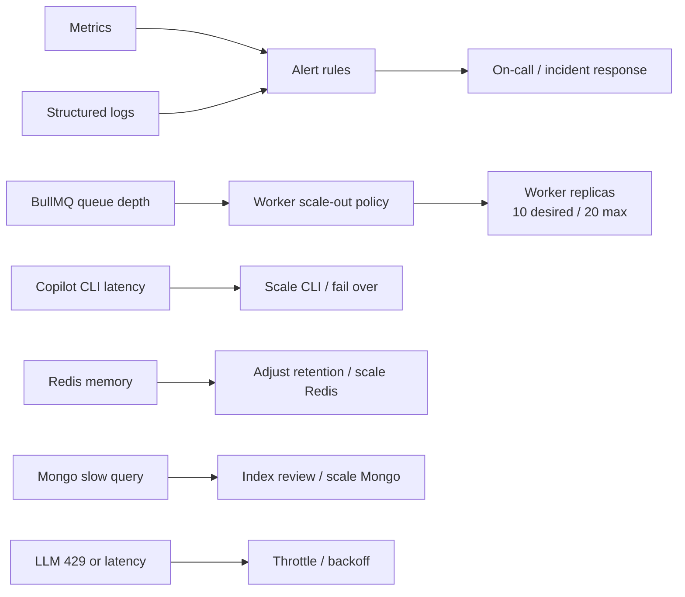

### 講稿內容

這一頁說明正式環境需要追蹤的觀測指標，這些指標同時適用地端與雲端。API 層要看 p95 latency、5xx rate 與 SSE disconnect；worker 層要看 queue depth、job duration 與 failed rate；Redis 要看 memory、evictions、ops/sec 與 latency；MongoDB 要看 slow queries、connections、index size 與 working set。

對 InfoGather 來說，Copilot CLI 與 LLM provider 也必須納入正式監控。Copilot CLI 應追蹤 session latency、active sessions、error rate 與 container restart；LLM provider 則要追蹤 latency、429/5xx 與每日成本。worker 擴充不能只看 CPU，因為這類工作大多是 I/O 與外部 API bound。雲端可以把 queue depth 接到 autoscaling policy；地端即使沒有自動擴充，也應建立明確的擴充門檻與操作程序。實務上，queue depth、job duration、Copilot CLI session latency 與 LLM 429 rate，會比 CPU 更能反映真正瓶頸。

---

## 16. 成本最佳化與工程治理項目

### 投影片重點

優先改善項目：

| 優先順序 | 項目 | 預期效果 |
|---:|---|---|
| P0 | 維持 feed/article/assistant jobs 的 `removeOnComplete` / `removeOnFail` | 控制 Redis RAM 與雲端 Redis 成本 |
| P0 | 定期檢查 BullMQ retention 與 queue backlog | 維持 Redis used memory 在可控範圍，避免歷史 job 再次累積 |
| P1 | worker job payload 改存 ID，處理時再查 DB | 降低 Redis payload size |
| P1 | 設定 worker concurrency 與 LLM/API rate limit | 避免尖峰時外部 API 429 |
| P1 | 為 Copilot CLI 加健康檢查、私有 LB 與 session latency dashboard | 降低 LLM runtime 單點故障與瓶頸風險 |
| P1 | 加上 queue depth dashboard | 讓擴充決策可量化 |
| P2 | 檢視 articles / assistantarticles indexes | 控制 MongoDB index 成長 |
| P2 | 設定資料保留策略或冷儲存 | 控制長期 storage 成本 |

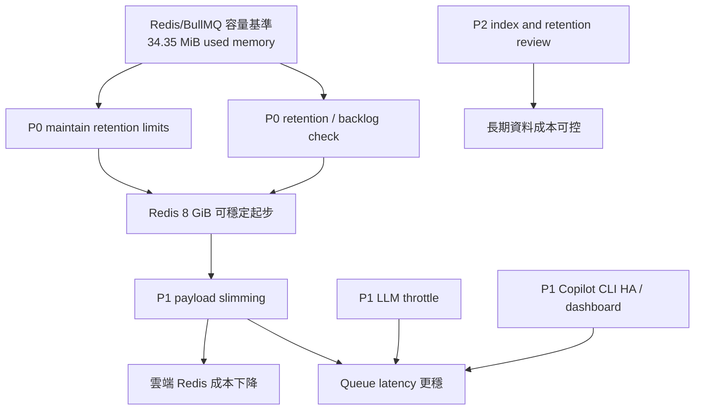

### 講稿內容

這一頁列出正式環境前最值得優先處理的工程治理項目。P0 的重點是維持 BullMQ retention 設定、定期檢查 queue backlog 與 failed jobs，並避免部署或環境變數變更讓 completed / failed jobs 再次無限制累積。在目前容量基準下，8 GiB managed Redis 通常可支撐目前資料量與 10 worker 起步。

P1 則包含 worker job payload 瘦身、worker concurrency 與 LLM/API rate limit、Copilot CLI healthcheck / private LB / session latency dashboard，以及 queue depth dashboard。這些項目可以降低尖峰時的 API 429、Redis payload size 與 LLM runtime 單點故障風險。P2 則是中長期治理，包括 articles / assistantarticles index review，以及資料保留或冷儲存策略，確保資料成長後仍能控制 storage 與 index 成本。

---

## 17. 導入時程與決策建議

### 投影片重點

建議採取分階段導入，先降風險，再搬正式環境。

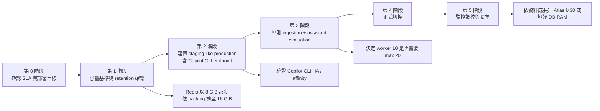

### 建議決策

| 決策項 | 建議 |
|---|---|
| 正式架構首選 | 雲端：managed MongoDB + managed Redis + container app/worker/scheduler + Copilot CLI private endpoint |
| 地端首選 | HA 版：App/Worker 節點 x3、Copilot CLI x2、MongoDB replica set x3、Redis HA x2-3 |
| 成本優先地端 | 單機最低 16 vCPU / 64 GiB / 1 TB NVMe；全同機保守 24 vCPU / 64 GiB，但需接受單點故障 |
| Worker 基準 | 維持 desired 10 replicas；依 queue depth 擴到 20 |
| 立即改善 | BullMQ retention 檢查、Copilot CLI health/session dashboard、queue dashboard |

### 講稿內容

最後這一頁是建議的導入路線。第 0 階段先確認正式環境的 SLA、RPO/RTO、地端或雲端偏好，以及是否接受單點故障。第 1 階段確認容量基準、BullMQ retention、Redis queue depth 與 failed rate，確保正式環境起始規格建立在目前實測狀態上。

第 2 階段建立 staging-like production，這個環境必須包含 Copilot CLI endpoint，而不是只測 app 與 worker。第 3 階段進行 ingestion 與 assistant evaluation 壓測，確認 10 worker 是否足夠、是否需要 max 20，以及 Copilot CLI HA / affinity 是否穩定。第 4 階段再進行正式切換，第 5 階段依監控資料調整 worker、Redis、MongoDB 與 Copilot CLI 規格。整體建議是：雲端優先採 managed MongoDB、managed Redis、container app/worker/scheduler 與 Copilot CLI private endpoint；地端若要正式 SLA，則以 App/Worker 節點、Copilot CLI、MongoDB replica set 與 Redis HA 的拆分架構為目標。

---

## 附錄 A：資料查詢摘要

### MongoDB

| 指標 | 值 |
|---|---:|
| database | infogather |
| collection count | 29 |
| total documents | 1,113,082 |
| data size | 約 934.84 MiB |
| storage size | 約 540.86 MiB |
| index size | 約 824.84 MiB |
| total physical size | 約 1.36 GiB |

### Top collections

| Collection | Count | Logical data | Index |
|---|---:|---:|---:|
| assistantarticles | 859,775 | 約 416.40 MiB | 約 80.18 MiB |
| articles | 246,876 | 約 512.89 MiB | 約 740.98 MiB |
| notifications | 2,662 | 約 1.66 MiB | 約 0.25 MiB |
| adminaudits | 983 | 約 0.30 MiB | 約 0.06 MiB |

### Redis / BullMQ

| 指標 | 值 |
|---|---:|
| previous observed used memory | 約 3.56 GiB |
| peak memory | 約 3.71 GiB |
| current used memory | 約 34.35 MiB |
| key count | 約 1,502 |
| instantaneous ops/sec | 約 119 |
| waiting / active jobs | 0 / 10 |
| prioritized jobs | assistant 694 |
| completed jobs，主要 queue | assistant 216；article 0；feed 0 |
| failed jobs，主要 queue | assistant 16；article 0；feed 0 |

### Copilot CLI server

| 指標 | 值 |
|---|---:|
| container | `copilot-cli` |
| image | `chunkai1312/copilot-cli:latest` |
| uptime | 約 2 週 |
| current memory | 約 293.7 MiB |
| current CPU | 約 0.01% idle sample |
| integration contract | `COPILOT_CLI_URL` private endpoint |
| production sizing | 1 到 2 replicas，每個 1 到 2 vCPU / 1 到 2 GiB；10 worker 高併發情境建議總預留 2 vCPU / 2 到 4 GiB |

---

## 附錄 B：正式環境規格總表

| 方案 | 適用 | Compute | Data services | 優點 | 注意事項 |
|---|---|---|---|---|---|
| 地端單機正式起步 | 低成本、內部正式 | 最低 16 vCPU / 64 GiB / 1 TB NVMe；全同機保守 24 vCPU / 64 GiB，含 Copilot CLI 2 vCPU / 2 到 4 GiB 預留 | MongoDB + Redis 同機或同虛擬化叢集 | 成本低、導入快 | 單點故障，需強化備份與 CLI 重啟策略 |
| 地端 HA | 對外正式、需維運窗口 | App/Worker x3 nodes + Copilot CLI x2 | MongoDB RS x3 + Redis HA x2-3 | 可維護、可擴充 | 建置與維運複雜度高，CLI 需驗證 affinity |
| 雲端標準 | 最推薦 | API x2、Worker x10、Scheduler x1、Copilot CLI x1-2 | Atlas M20/M30 + Redis 8-16 GiB | 風險低、備份與 HA 成熟 | 月費較高，需控管 LLM/API 與 CLI session 成本 |
