# InfoGather 正式環境資源與系統架構提案

日期：2026-06-01  
版本：v1.0  
目的：依據目前資料量、Docker worker 併發與實機資源觀測，提出正式環境的地端與雲端系統架構、硬體規格、擴充策略與導入路線。

## 簡報大綱

1. 專案目標與結論摘要
2. 目前環境與執行基準
3. 資料量現況
4. 成長趨勢與壓力來源
5. 現行處理流程與 10 worker 模式
6. 關鍵瓶頸：Redis 與 BullMQ job history
7. 正式環境 sizing 原則
8. 地端完整系統架構
9. 地端硬體規格建議
10. 地端部署級距與高可用設計
11. 雲端完整系統架構
12. 雲端服務選型與資源規格
13. 安全、備份與災難復原
14. 監控、告警與自動擴充
15. 成本最佳化與工程改善項目
16. 導入路線與決策建議

---

## 1. 專案目標與結論摘要

### 投影片重點

- InfoGather 目前已具備正式化條件，但資源提案必須以 10 個 worker container 為基準，而不是單一 worker。
- 現有資料量不大：MongoDB data + index 約 1.36 GiB；真正的短期瓶頸是 Redis 已使用約 3.56 GiB。
- 目前主機為 8 vCPU / 15 GiB RAM，可支撐開發或低流量環境；正式環境建議提高到 16 vCPU / 64 GiB 起步，或採雲端拆分式架構。
- 首要工程改善是 BullMQ completed/failed job retention，這會直接降低 Redis RAM 與正式環境成本。

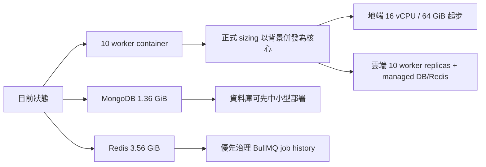

### 講者提示

這份提案的重點不是單純把目前主機放大，而是把 InfoGather 的負載拆成三類：Web/API 請求、背景 ingestion/assistant 工作、資料層持久化。正式環境應把 worker 併發、Redis 記憶體與 MongoDB 索引一起納入規劃。

---

## 2. 目前環境與執行基準

### 投影片重點

| 項目 | 目前觀測 |
|---|---:|
| 主機 CPU | 8 vCPU |
| 主機 RAM | 15 GiB total / 約 3.4 GiB available |
| CPU 型號 | Intel Xeon Gold 6444Y |
| InfoGather app | 1 container，約 104 MiB RAM |
| InfoGather scheduler | 1 container，約 42 MiB RAM |
| InfoGather worker | 10 containers，單個約 88 到 116 MiB RAM |
| MongoDB container | 約 1.53 GiB RAM |
| Redis container | 約 3.49 GiB RAM，單次取樣 CPU 約 94% |

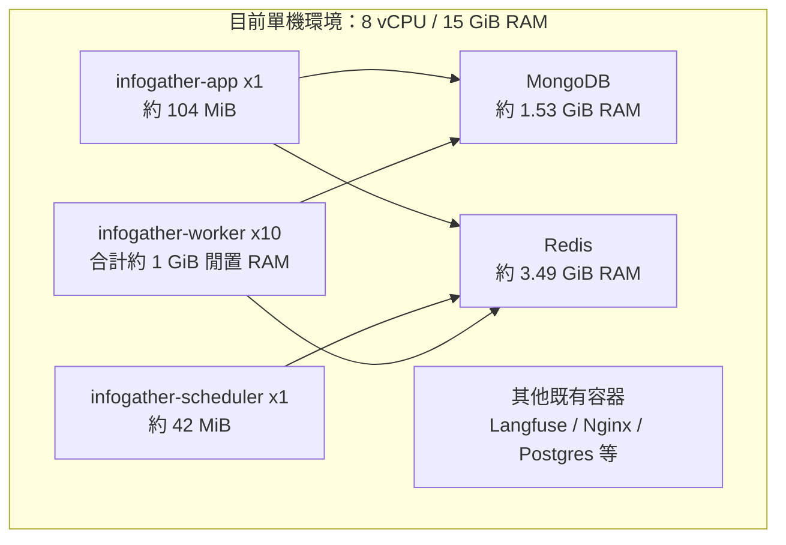

### 講者提示

目前 10 個 worker 閒置 RAM 不高，但它們代表 10 倍背景工作消化能力，也代表 Redis、MongoDB 與外部 LLM/API 可能被 10 路併發推高。正式規格要看尖峰，不只看閒置。

---

## 3. 資料量現況

### 投影片重點

| 資料類型 | 數量 / 用量 |
|---|---:|
| MongoDB collections | 29 |
| MongoDB documents | 1,113,082 |
| MongoDB logical data | 約 934.84 MiB |
| MongoDB storage + indexes | 約 1.36 GiB |
| 使用者 | 172 |
| 工作區 | 29 |
| 資料來源 feeds | 176，其中 159 active |
| 資訊助手 assistants | 41，其中 38 active |
| articles | 246,876 |
| assistantarticles | 859,775 |
| notifications | 2,662 |

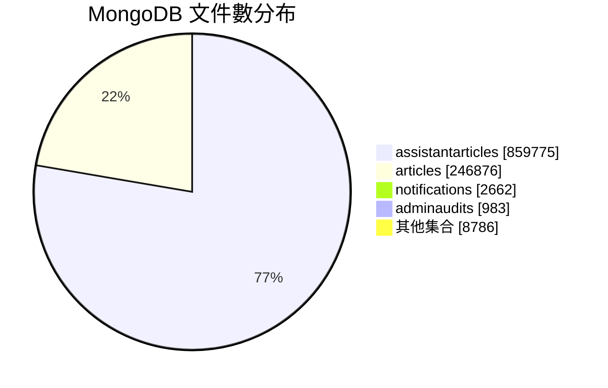

### 講者提示

資料庫目前還不是大型資料庫；文件數主要集中在助手文章評估與文章本體。MongoDB index 約 825 MiB，其中 articles index 約 741 MiB，是 RAM sizing 的重要依據。

---

## 4. 成長趨勢與壓力來源

### 投影片重點

| 指標 | 近 1 天 | 近 7 天 | 近 30 天 |
|---|---:|---:|---:|
| 新增 articles | 3,163 | 37,432 | 103,698 |
| 新增 assistantarticles | 8,490 | 132,961 | 418,290 |
| 新增 users | - | 11 | 40 |

近 7 天文章來源分布：

| 來源 | 新增文章數 |
|---|---:|
| RSS | 31,035 |
| Infominer | 5,803 |
| Search | 594 |

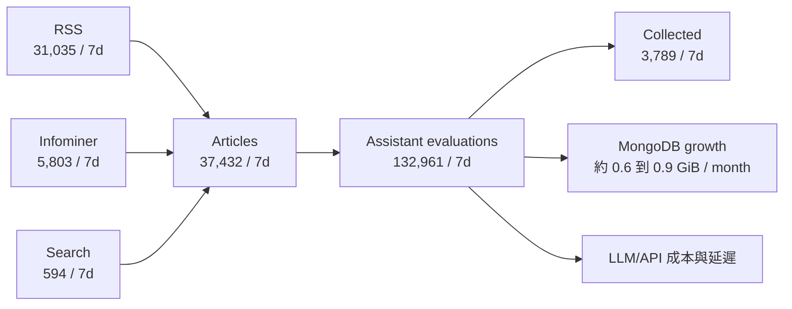

### 講者提示

目前成長最重的是 RSS ingestion 和 assistant evaluation。近 7 天每篇文章平均產生約 3.55 筆助手評估，因此 worker 併發與 LLM 呼叫成本會比文章數本身更敏感。

---

## 5. 現行處理流程與 10 Worker 模式

### 投影片重點

- `scheduler` 負責排程到期 feed。
- `feed` queue 抓取 RSS/Search/Infominer 文章。
- `article` queue 進行去重、萃取、摘要與入庫。
- `assistant` queue 對文章進行助手規則評估。
- 目前 10 個 worker container 都載入 queue processors，等於所有背景 queue 都有 10 個消費者競爭處理。

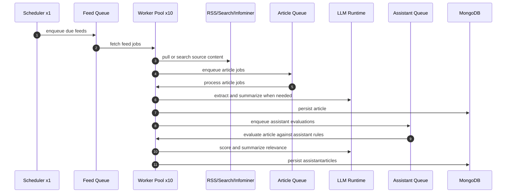

### 講者提示

10 worker 是吞吐量設計，不是單純備援數量。正式環境要配置足夠 Redis、MongoDB connection pool、外部 API rate limit 與 LLM concurrency control。

---

## 6. 關鍵瓶頸：Redis 與 BullMQ Job History

### 投影片重點

目前 Redis/BullMQ 觀測：

| 指標 | 目前值 |
|---|---:|
| Redis memory | 約 3.56 GiB |
| Redis keys | 約 695,402 |
| waiting jobs | 0 |
| active jobs | 0 |
| feed completed / failed | 33,047 / 6,174 |
| article completed / failed | 135,743 / 451 |
| assistant completed / failed | 459,811 / 59,576 |

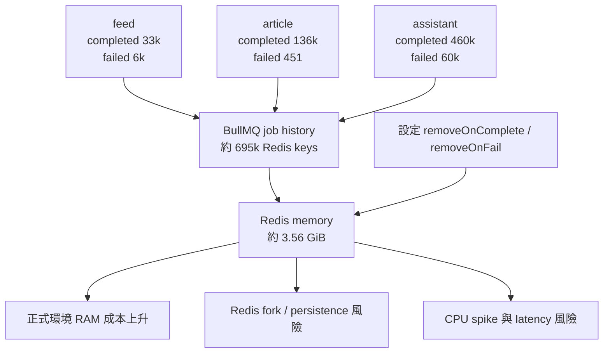

### 講者提示

Redis 不是因為現在有 backlog 才高，而是完成和失敗的 job history 留太多。這是正式環境前最值得先做的成本改善。

---

## 7. 正式環境 Sizing 原則

### 投影片重點

正式 sizing 不只看資料庫大小，而是綜合以下因子：

| 因子 | 對資源的影響 |
|---|---|
| 10 worker container | 提高背景併發與外部 API 壓力 |
| MongoDB indexes | 決定 DB RAM 與查詢延遲 |
| Redis job history | 決定 Redis RAM 與成本 |
| Article growth | 決定 MongoDB storage 與備份容量 |
| Assistant evaluation | 決定 LLM 成本、worker 吞吐量與 queue 深度 |
| 備份與 HA | 決定磁碟、網路與節點數 |

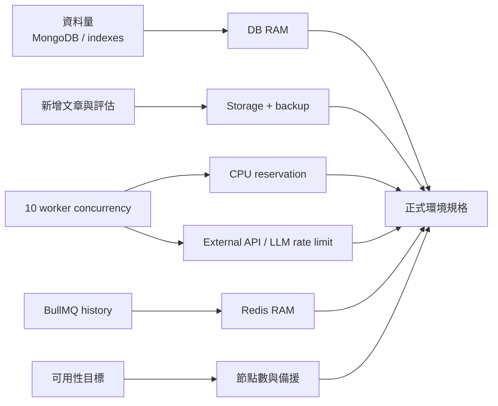

### 講者提示

建議用「資源預留 + 指標驅動擴充」：worker 初期維持 10 replicas，但透過 queue depth、LLM latency、Redis memory、MongoDB working set 來決定是否升級。

---

## 8. 地端完整系統架構

### 投影片重點

地端正式環境建議拆成四層：入口層、應用層、資料層、觀測與備份層。

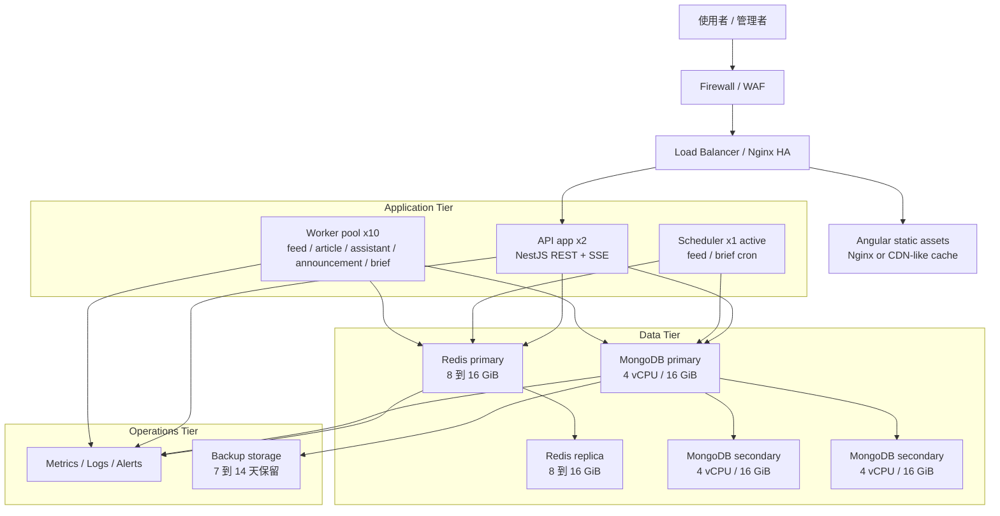

### 講者提示

若需要真正高可用，MongoDB 與 Redis 不建議和 10 個 worker 擠在同一台主機。應用層可容器化水平擴充；資料層獨立資源與備份策略。

---

## 9. 地端硬體規格建議

### 投影片重點

### 單機正式起步，成本優先

| 元件 | 建議規格 |
|---|---:|
| 主機 | 16 vCPU / 64 GiB RAM |
| 磁碟 | 1 TB NVMe SSD |
| Worker | 10 containers，每個預留 0.5 到 1 vCPU / 512 MiB 到 1 GiB |
| Redis | 預留 8 到 16 GiB RAM |
| MongoDB | 預留 8 到 16 GiB RAM |
| 備份 | 1 到 2 TB 外部或 NAS 備份空間 |

### 高可用正式版，建議目標

| 層級 | 建議規格 |
|---|---|
| App/Worker 節點 | 3 台，每台 8 vCPU / 32 GiB RAM |
| MongoDB replica set | 3 台，每台 4 vCPU / 16 GiB RAM / 500 GB NVMe SSD |
| Redis HA | 2 到 3 台，每台 2 到 4 vCPU / 8 到 16 GiB RAM |
| Load balancer | 2 台小型 VM 或硬體/虛擬 LB |
| Backup | 每日至少一次，保留 7 到 14 天 |

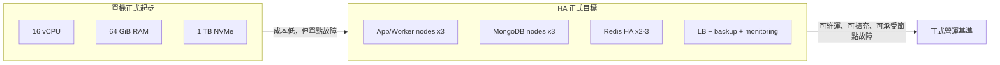

### 講者提示

8 vCPU / 32 GiB 可以視為最低可用級距，但在 10 worker 以及 Redis 目前 3.56 GiB 的情況下，正式營運建議不要低於 16 vCPU / 64 GiB。

---

## 10. 地端部署級距與高可用設計

### 投影片重點

| 級距 | 適用情境 | 優點 | 風險 |
|---|---|---|---|
| 單機增強版 | 內部正式、低成本 | 建置快、成本低 | 主機故障即中斷 |
| 雙層拆分版 | API/worker 與 DB/Redis 分離 | 降低資源互搶 | DB/Redis 仍需備援 |
| HA 版 | 對外正式營運 | 可維護、可擴充 | 成本與維運複雜度較高 |

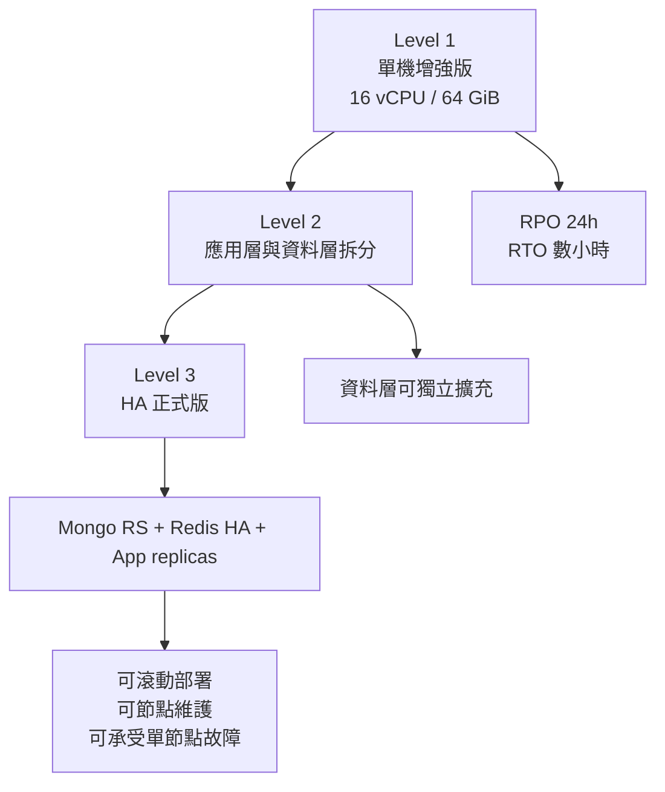

### 講者提示

地端若有正式 SLA，建議至少做到 Level 2；若有對外客戶或跨部門關鍵依賴，目標應是 Level 3。

---

## 11. 雲端完整系統架構

### 投影片重點

雲端建議採 managed data services，應用層容器化，worker 以 10 replicas 為 desired count。

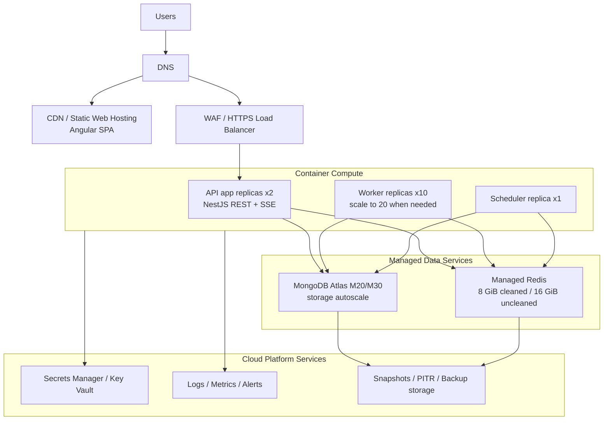

### 講者提示

雲端的最大價值是把 MongoDB、Redis、備份、監控與 HA 外包給成熟服務。應用層只要維持 app、worker、scheduler 三種 runtime role。

---

## 12. 雲端服務選型與資源規格

### 投影片重點

| 元件 | 建議規格 |
|---|---|
| Web | Static hosting + CDN |
| API app | 2 replicas，每個 1 到 2 vCPU / 2 到 4 GiB RAM |
| Worker | desired 10 replicas，每個 0.5 到 1 vCPU / 512 MiB 到 1 GiB RAM |
| Scheduler | 1 replica，0.5 到 1 vCPU / 512 MiB 到 1 GiB RAM |
| MongoDB | Atlas M20 起步；正式穩定或成長後升 M30 |
| Redis | 8 GiB 起步；未清 job history 前建議 16 GiB |
| Backup | MongoDB daily snapshots + PITR；Redis 依 queue 可重建程度決定 |

| 類別 | AWS | Azure | GCP |
|---|---|---|---|
| Container | ECS/Fargate 或 EKS | Container Apps 或 AKS | Cloud Run 或 GKE |
| CDN/WAF | CloudFront + WAF | Front Door + WAF | Cloud CDN + Cloud Armor |
| Redis | ElastiCache Redis | Azure Cache for Redis | Memorystore for Redis |
| MongoDB | MongoDB Atlas on AWS | MongoDB Atlas on Azure | MongoDB Atlas on GCP |
| Secrets | Secrets Manager | Key Vault | Secret Manager |
| Observability | CloudWatch | Azure Monitor | Cloud Monitoring |

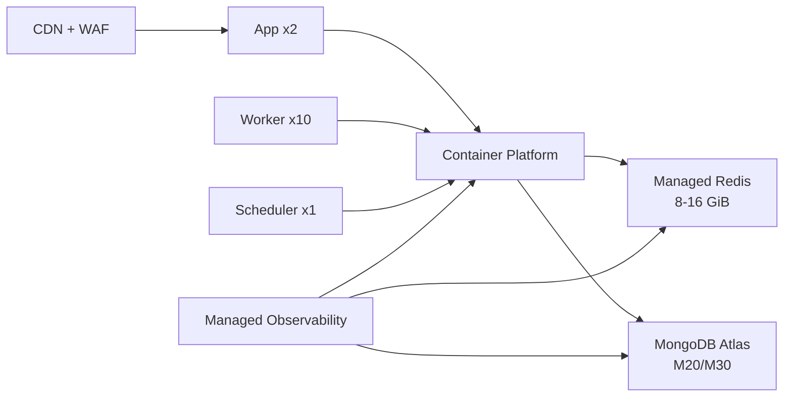

### 講者提示

不建議第一階段把 MongoDB 換成相容層資料庫，因為目前系統使用 Mongoose 與 MongoDB query/index 語意；Atlas 是遷移風險最低的雲端路徑。

---

## 13. 安全、備份與災難復原

### 投影片重點

正式環境必備控制：

| 面向 | 建議 |
|---|---|
| 網路 | Web/API 對外；MongoDB/Redis 僅 private network |
| 憑證 | TLS everywhere；秘密值放 Secrets Manager/Key Vault |
| 身分權限 | 最小權限、分角色帳號、資料庫帳號分 app/backup/admin |
| 備份 | MongoDB daily snapshot + restore drill |
| RPO/RTO | 起步 RPO 24h / RTO 4h；正式 HA 可降到 RPO 1h / RTO 1h |
| 稽核 | admin audit、登入、資料異動與 queue failure 保留 |

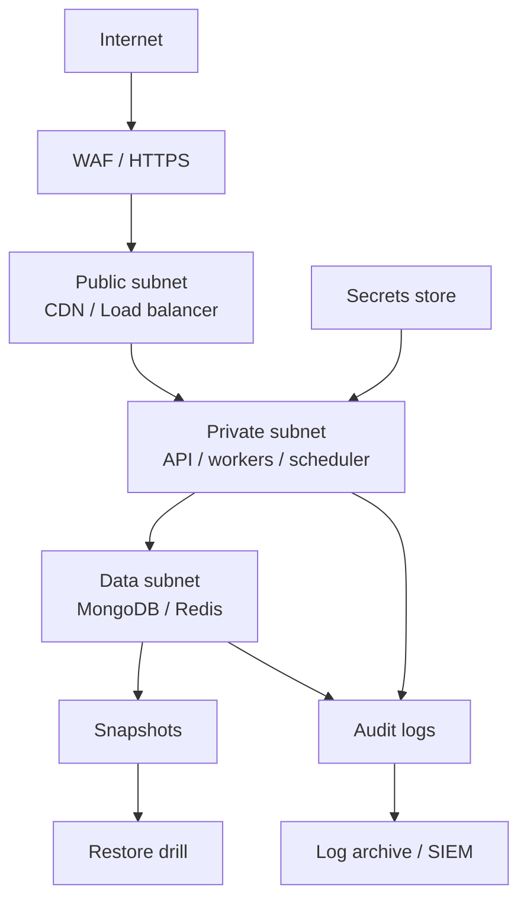

### 講者提示

資料層不應暴露公網。備份策略不只是排程，還要包含定期還原演練，否則無法確認 RTO/RPO 是否真的可達成。

---

## 14. 監控、告警與自動擴充

### 投影片重點

正式環境監控指標：

| 類別 | 指標 | 建議告警 |
|---|---|---|
| API | p95 latency、5xx rate、SSE disconnects | p95 > 1s 或 5xx > 1% |
| Worker | queue depth、job duration、failed rate | waiting > 1,000 或 failed rate > 5% |
| Redis | memory、evictions、ops/sec、latency | memory > 75% 或 evictions > 0 |
| MongoDB | index size、working set、slow queries、connections | slow query 增加或 connections > 80% |
| LLM/API | latency、429/5xx、cost per day | 429 出現或每日成本超標 |
| Storage | DB growth、backup success | backup failed 或 disk > 70% |

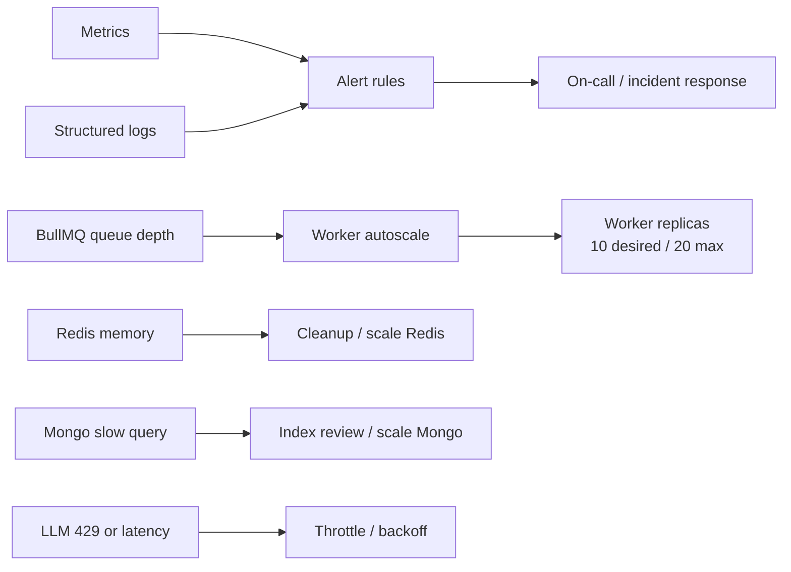

### 講者提示

worker 擴充不能只看 CPU，因為工作大多是 I/O 與外部 LLM/API bound。queue depth、job duration 與 429 rate 比 CPU 更能代表真實容量。

---

## 15. 成本最佳化與工程改善項目

### 投影片重點

優先改善項目：

| 優先順序 | 項目 | 預期效果 |
|---:|---|---|
| P0 | 為 feed/article/assistant jobs 設定 `removeOnComplete` / `removeOnFail` | 降低 Redis RAM 與雲端 Redis 成本 |
| P0 | 清理既有 BullMQ job history | 釋放目前約 3.56 GiB Redis 壓力 |
| P1 | worker job payload 改存 ID，處理時再查 DB | 降低 Redis payload size |
| P1 | 設定 worker concurrency 與 LLM/API rate limit | 避免尖峰時外部 API 429 |
| P1 | 加上 queue depth dashboard | 讓擴充決策可量化 |
| P2 | 檢視 articles / assistantarticles indexes | 控制 MongoDB index 成長 |
| P2 | 設定資料保留策略或冷儲存 | 控制長期 storage 成本 |

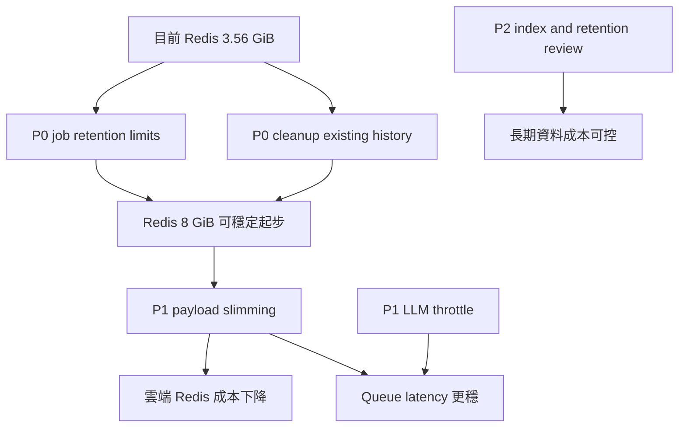

### 講者提示

如果不做 P0，雲端 Redis 建議先抓 16 GiB；如果完成 P0，8 GiB 通常足以支撐目前資料量與 10 worker 起步。

---

## 16. 導入路線與決策建議

### 投影片重點

建議採取分階段導入，先降風險，再搬正式環境。

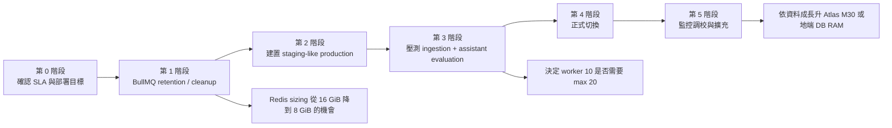

### 建議決策

| 決策項 | 建議 |
|---|---|
| 正式架構首選 | 雲端：managed MongoDB + managed Redis + container app/worker/scheduler |
| 地端首選 | HA 版：App/Worker 節點 x3、MongoDB replica set x3、Redis HA x2-3 |
| 成本優先地端 | 單機 16 vCPU / 64 GiB / 1 TB NVMe，但需接受單點故障 |
| Worker 基準 | 維持 desired 10 replicas；依 queue depth 擴到 20 |
| 立即改善 | BullMQ retention、Redis cleanup、queue dashboard |

### 講者提示

最穩的路線是先完成 Redis/BullMQ 治理，再決定地端或雲端。這能避免把暫時性的 job history 成本誤判成永久硬體需求。

---

## 附錄 A：資料查詢摘要

### MongoDB

| 指標 | 值 |
|---|---:|
| database | infogather |
| collection count | 29 |
| total documents | 1,113,082 |
| data size | 約 934.84 MiB |
| storage size | 約 540.86 MiB |
| index size | 約 824.84 MiB |
| total physical size | 約 1.36 GiB |

### Top collections

| Collection | Count | Logical data | Index |
|---|---:|---:|---:|
| assistantarticles | 859,775 | 約 416.40 MiB | 約 80.18 MiB |
| articles | 246,876 | 約 512.89 MiB | 約 740.98 MiB |
| notifications | 2,662 | 約 1.66 MiB | 約 0.25 MiB |
| adminaudits | 983 | 約 0.30 MiB | 約 0.06 MiB |

### Redis / BullMQ

| 指標 | 值 |
|---|---:|
| used memory | 約 3.56 GiB |
| key count | 約 695,402 |
| instantaneous ops/sec | 約 119 |
| waiting / active jobs | 0 / 0 |
| completed jobs，主要 queue | assistant 459,811；article 135,743；feed 33,047 |
| failed jobs，主要 queue | assistant 59,576；feed 6,174；article 451 |

---

## 附錄 B：正式環境規格總表

| 方案 | 適用 | Compute | Data services | 優點 | 注意事項 |
|---|---|---|---|---|---|
| 地端單機正式起步 | 低成本、內部正式 | 16 vCPU / 64 GiB / 1 TB NVMe | MongoDB + Redis 同機或同虛擬化叢集 | 成本低、導入快 | 單點故障，需強化備份 |
| 地端 HA | 對外正式、需維運窗口 | App/Worker x3 nodes | MongoDB RS x3 + Redis HA x2-3 | 可維護、可擴充 | 建置與維運複雜度高 |
| 雲端標準 | 最推薦 | API x2、Worker x10、Scheduler x1 | Atlas M20/M30 + Redis 8-16 GiB | 風險低、備份與 HA 成熟 | 月費較高，需控管 LLM/API 成本 |
