# InfoGather 正式環境資源與系統架構提案

日期：2026-06-02  
版本：v1.15  
目的：依據目前資料量、Docker worker 併發、Copilot CLI server 依賴與實機資源觀測，提出正式環境的地端與雲端系統架構、硬體規格、擴充策略與導入路線。

## 簡報大綱

1. 專案技術堆疊與系統邊界概覽
2. 現行環境盤點與容量基準
3. 平台資料規模現況
4. 資料成長趨勢與負載來源分析
5. 背景處理流程與 Worker 併發模型
6. Copilot CLI Server 與 LLM Runtime 架構依賴
7. 容量估算模型與正式規格推導
8. 地端正式環境目標架構
9. 地端硬體資源配置建議
10. 雲端正式環境目標架構
11. 雲端服務選型與資源配置建議
12. 安全控管、備份與災難復原策略
13. 可觀測性、告警與擴充機制
14. 正式環境建置結論與導入建議

---

## 1. 專案技術堆疊與系統邊界概覽

### 投影片重點

本頁建立後續容量估算與架構提案的共同技術脈絡。

| 層級 | 技術 / 元件 | 正式環境定位 |
|---|---|---|
| Frontend | Angular SPA | 使用者介面與前端路由，靜態資產可由 Nginx、CDN 或 static hosting 提供 |
| Backend | Node.js / NestJS API | REST API、SSE、工作區權限、feeds、articles、assistants、briefs 與 agent runtime |
| Monorepo | Nx + TypeScript | 前後端一致建置、測試與部署管理 |
| Database | MongoDB + Mongoose | 儲存文章、助手評估、工作區、通知、briefs 與使用者狀態 |
| Queue | Redis + BullMQ | 承載 feed、article、assistant、brief、announcement 等背景工作 |
| Background runtime | Scheduler + worker pool | 排程與背景處理；正式 sizing 以 10 個 worker container 為基準 |
| LLM runtime | Copilot CLI server + OpenAI-compatible BYOK provider | Agent chat、文章萃取、摘要與助手評估的 LLM control plane |
| Deployment | Docker containers | 可落地於地端 VM/HA 架構或雲端 container platform |

### 講稿內容

這一頁我先帶大家建立共同畫面。InfoGather 可以先看成三個主要區塊：第一個是使用者會接觸到的前端，也就是 Angular SPA；第二個是後端 API，也就是跑在 Node.js 上的 NestJS API；第三個是背景處理與資料層，包含 scheduler、worker、MongoDB、Redis 和 BullMQ。

這裡特別要注意的是，InfoGather 不是只有一個 Web/API 服務在跑。資料來源抓取、文章處理、助手評估、brief 產生，這些都會交給背景 worker 處理。也就是說，正式環境的壓力不只來自使用者打 API，也來自後台持續處理資料。

另外，LLM 相關流程會透過 Copilot CLI server 作為共用的 runtime endpoint。API 和 worker 都會連到它，再由它轉接 OpenAI-compatible BYOK provider。所以後面在估算正式環境規格時，我們不能只看 Web/API 和 MongoDB，還要一起看 worker pool、Redis queue、Copilot CLI、MongoDB index，以及外部 LLM/API 的限制。

最後，這套系統目前已經是容器化的架構，因此未來可以部署在地端 VM、地端高可用架構，也可以放到雲端 container platform。地端和雲端的差別，主要是在網路隔離、資料服務、備份、高可用和監控工具怎麼落地；核心系統邊界是相同的。

---

## 2. 現行環境盤點與容量基準

### 投影片重點

| 項目 | 目前觀測 |
|---|---:|
| 主機 CPU | 8 vCPU |
| 主機 RAM | 15 GiB total / 約 3.4 GiB available |
| CPU 型號 | Intel Xeon Gold 6444Y |
| InfoGather app | 1 container，約 104 MiB RAM |
| InfoGather scheduler | 1 container，約 42 MiB RAM |
| InfoGather worker | 10 containers，單個約 88 到 116 MiB RAM |
| Copilot CLI server | 1 container，約 294 MiB RAM |
| MongoDB container | 約 1.53 GiB RAM |
| Redis container | 約 156.7 MiB RAM；Redis used memory 約 34.35 MiB |

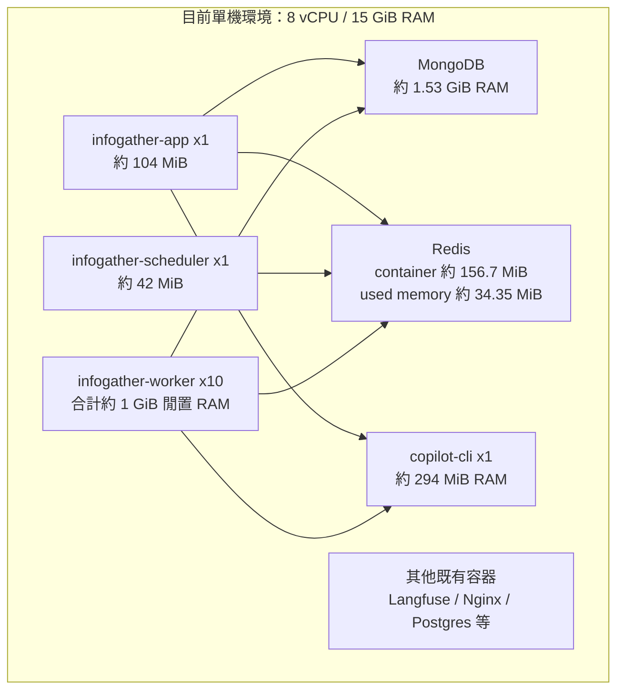

### 講稿內容

接下來我們看目前實際跑起來的環境。現在這台主機是 8 vCPU、15 GiB RAM，上面同時跑了 InfoGather app、scheduler、10 個 worker、MongoDB、Redis、Copilot CLI server，還有其他既有服務。

從當下觀測的記憶體來看，單一 worker 大約使用 88 到 116 MiB，10 個 worker 合計大約 1 GiB。Copilot CLI server 大約 294 MiB，MongoDB 大約 1.53 GiB，Redis container 大約 156.7 MiB，而 Redis 自己真正使用的 memory 大約是 34.35 MiB。

這些數字可以幫我們理解現況，但不能直接拿來當正式環境規格。原因是這比較像某個時間點的 snapshot，不代表尖峰情境。當 feed 抓取、文章萃取、助手評估同時發生時，10 個 worker 會一起把壓力推到 Redis、MongoDB、Copilot CLI，以及外部 LLM/API。

所以這一頁要傳達的重點是：目前主機可以作為容量基準，但正式環境不能只看平均 RAM 用量。正式環境需要預留尖峰、服務隔離、備份、高可用和維運操作的空間。

---

## 3. 平台資料規模現況

### 投影片重點

| 資料類型 | 數量 / 用量 |
|---|---:|
| MongoDB collections | 29 |
| MongoDB documents | 1,113,082 |
| MongoDB logical data | 約 934.84 MiB |
| MongoDB storage + indexes | 約 1.36 GiB |
| 使用者 | 172 |
| 工作區 | 29 |
| 資料來源 feeds | 176，其中 159 active |
| 資訊助手 assistants | 41，其中 38 active |
| articles | 246,876 |
| assistantarticles | 859,775 |
| notifications | 2,662 |

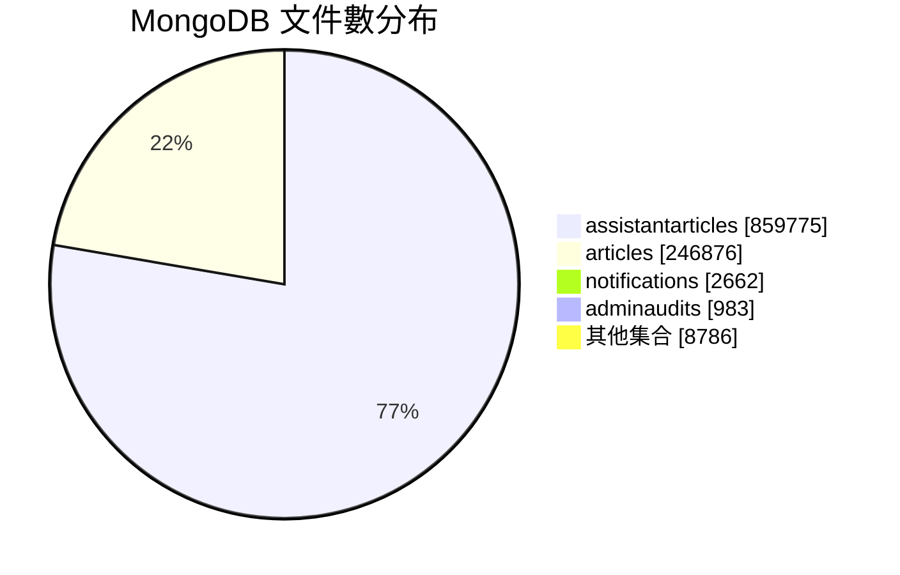

### 講稿內容

這一頁我們來看資料量。現在 MongoDB 裡面共有 29 個 collections，總文件數大約 111 萬筆。資料本體加上索引，實體大小大約是 1.36 GiB。以正式環境資料庫來說，這個大小其實還不算大，所以短期內不需要一開始就上非常大的資料庫叢集。

不過，資料量小不代表可以忽略資料庫規格。真正要看的，是資料集中在哪裡。目前最大宗是 `articles` 和 `assistantarticles`。`articles` 大約 24.7 萬筆，是平台實際收進來的文章；`assistantarticles` 大約 86 萬筆，代表助手對文章做過的評估結果。

這裡有一個重要觀察：MongoDB 的 index 大約 825 MiB，其中 articles 的 index 就大約 741 MiB。換句話說，未來查詢效能不只看資料本體大小，也要看索引能不能穩定留在記憶體裡。如果索引常常被擠出 memory，查詢延遲就會上升。因此後面規劃 MongoDB RAM 時，會以 working set 和 index growth 作為主要依據。

---

## 4. 資料成長趨勢與負載來源分析

### 投影片重點

| 指標 | 近 1 天 | 近 7 天 | 近 30 天 |
|---|---:|---:|---:|
| 新增 articles | 3,163 | 37,432 | 103,698 |
| 新增 assistantarticles | 8,490 | 132,961 | 418,290 |
| 新增 users | - | 11 | 40 |

近 7 天文章來源分布：

| 來源 | 新增文章數 |
|---|---:|
| RSS | 31,035 |
| Infominer | 5,803 |
| Search | 594 |

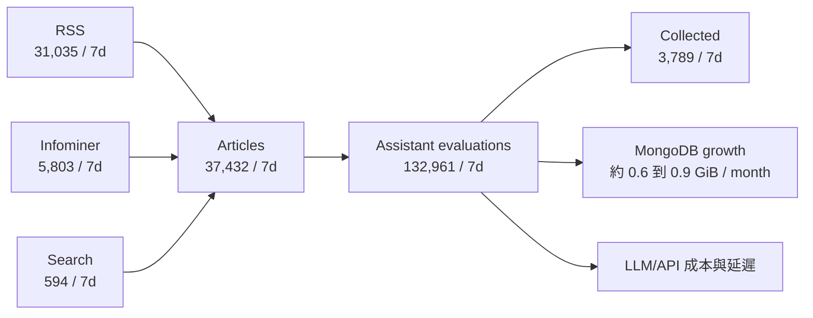

### 講稿內容

這一頁我們把時間拉長一點，看資料成長速度。過去 30 天新增了大約 10.4 萬篇文章，也新增了大約 41.8 萬筆助手評估。過去 7 天則新增大約 3.7 萬篇文章，以及 13.3 萬筆助手評估。

這代表一件事：InfoGather 的主要負載不是只有把文章存進資料庫。每一篇文章進來之後，還會再觸發多個助手規則評估，所以真正成長比較快的是 assistant evaluation 這一段。

從來源來看，近 7 天文章主要來自 RSS，其次是 Infominer，Search 目前比例比較低。用目前資料估算，每篇文章平均會產生大約 3.55 筆助手評估。因此，正式環境在規劃時，不能只問「每天新增幾篇文章」，還要問「這些文章會觸發多少次助手評估」。

這也解釋了為什麼 worker 併發、Copilot CLI session、LLM provider rate limit 和 LLM 成本會變得很重要。文章數增加時，後面的評估工作會被放大，所以正式環境應該把 assistant evaluation 視為主要負載來源。

---

## 5. 背景處理流程與 Worker 併發模型

### 投影片重點

- `scheduler` 負責排程到期 feed。
- `feed` queue 抓取 RSS/Search/Infominer 文章。
- `article` queue 進行去重、萃取、摘要與入庫。
- `assistant` queue 對文章進行助手規則評估。
- 目前 10 個 worker container 都載入 queue processors，等於所有背景 queue 都有 10 個消費者競爭處理。

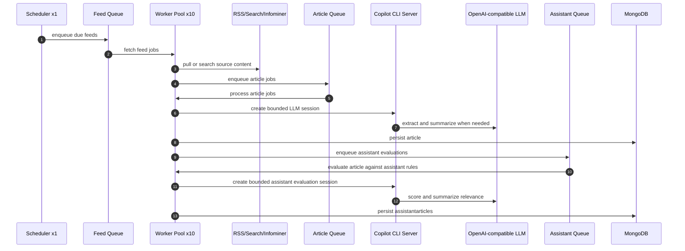

### 講稿內容

這一頁我們看背景工作實際怎麼跑。流程一開始是 scheduler，它會找出到期的 feed，然後把工作丟進 feed queue。worker 拿到工作之後，會去 RSS、Search 或 Infominer 這些來源抓資料。

抓到資料之後，系統會把文章送進 article queue。article processor 會做去重、萃取和摘要；如果需要 LLM，就會透過 Copilot CLI 建立 session，再轉接到 LLM provider。處理完成後，文章會寫入 MongoDB。

文章入庫之後，流程還沒有結束。系統會再依照文章來源和助手設定，把助手評估工作送進 assistant queue。worker 會再一次透過 Copilot CLI 和 LLM provider，判斷這篇文章跟某個助手的規則是否相關，最後把結果寫進 `assistantarticles`。

所以這裡要強調的是，10 個 worker 不是單純備援，而是目前的吞吐量基準。正式環境要一起規劃 Redis queue、MongoDB connection pool、Copilot CLI session capacity、外部 API rate limit，以及 LLM concurrency control。只增加 worker，但沒有處理後面這些瓶頸，整體吞吐量不一定會真的提升。

---

## 6. Copilot CLI Server 與 LLM Runtime 架構依賴

### 投影片重點

- API app 與 worker 都透過 `COPILOT_CLI_URL` 連到外部 Copilot CLI server。
- Copilot CLI server 負責 Copilot SDK session、JSON-RPC / streaming、工具呼叫協調、permission handler 與 OpenAI-compatible provider 轉接。
- 它不執行模型推論本身，但會承擔高併發 session orchestration；10 worker 會放大 CLI session 數與 LLM provider request rate。
- 目前容器閒置約 294 MiB RAM、CPU 幾乎為 0；正式環境不應用閒置值估算，需保留 session 尖峰與 HA 空間。
- 建議把 Copilot CLI server 視為獨立 runtime service：地端至少 2 vCPU / 2 到 4 GiB RAM；雲端至少 1 到 2 replicas，每個 1 到 2 vCPU / 1 到 2 GiB RAM。

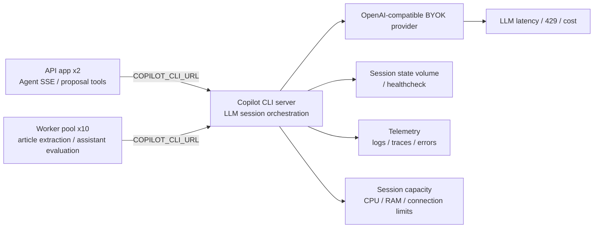

### 講稿內容

這一頁要特別補充 Copilot CLI server 的角色。它不是一般的小工具容器，而是 API app 和 worker 共用的 LLM runtime endpoint。系統會透過 `COPILOT_CLI_URL` 連到它，再由它負責 Copilot SDK session、JSON-RPC、streaming、工具呼叫協調、permission handler，以及轉接 OpenAI-compatible BYOK provider。

也就是說，Copilot CLI server 本身不做模型推論，但它負責管理 LLM 流程的控制面。只要它不穩，Agent chat、article extraction、assistant evaluation 都會受到影響。

目前看到它閒置時大約使用 294 MiB RAM，CPU 也幾乎沒有壓力。但正式環境不能用這個 idle 數字來估算，因為真正要看的是同時有多少 session、streaming 是否穩定，以及 10 個 worker 同時呼叫時會不會把它打滿。

因此正式環境建議把 Copilot CLI server 當成獨立 runtime service。地端至少預留 2 vCPU、2 到 4 GiB RAM；雲端至少規劃 1 到 2 個 replicas。如果要做高可用，還要驗證 session affinity 或 active/standby，避免水平擴充後造成 streaming session 中斷或狀態不一致。

---

## 7. 容量估算模型與正式規格推導

### 投影片重點

本頁說明正式規格如何從現況觀測推導，而不是只列出資源風險因子。

| 估算面向 | 現況基準 | 正式環境推導方式 | 規格影響 |
|---|---|---|---|
| 主機基準 | 8 vCPU / 約 15 GiB RAM | 現況只作參考，不直接作為正式規格 | 正式環境需預留尖峰、備援與維運空間 |
| 背景併發 | 10 個 worker container | 以 desired 10 為常態吞吐量，保留擴到 20 的空間 | 影響 CPU、Redis queue、MongoDB connections、LLM request rate |
| 資料庫 | MongoDB physical size 約 1.36 GiB，indexes 約 824.84 MiB | 以 working set、index growth、備份與查詢延遲估算 | 影響 MongoDB RAM、IOPS、storage 與備份容量 |
| Queue | Redis current 約 34.35 MiB，peak 約 3.71 GiB | 以 retention、backlog、failed jobs 與 queue depth 設計容量 | 影響 Redis RAM、持久化與告警門檻 |
| LLM runtime | Copilot CLI idle 約 294 MiB | 不用 idle 值估算，改以 session 尖峰與 HA 規劃 | 影響 Copilot CLI CPU/RAM、replicas 與 private endpoint 設計 |
| 可用性 | 單機開發 / 準正式基準 | 依 SLA、RPO/RTO 與是否接受單點故障決定 | 影響節點數、MongoDB replica set、Redis HA 與備份策略 |

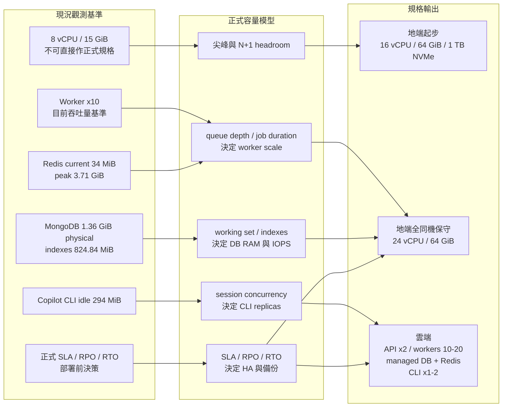

### 講稿內容

這一頁是整份提案的推導橋段。前面我們已經看到目前主機、資料量、worker 數量，以及 Copilot CLI 的角色；這一頁要回答的是：為什麼後面會推到這些正式環境規格。

首先，現行的 8 vCPU、約 15 GiB RAM，只能當作觀測基準，不能直接當成正式規格。原因很簡單：正式環境要多承擔尖峰流量、備份、高可用、維運操作，以及服務彼此之間的隔離。

接著我們看五個主要推導面向。第一是 10 個 worker container，這代表目前背景處理的常態吞吐量，所以正式環境至少要能穩定承接 10 個 worker，並且保留擴到 20 的空間。第二是 MongoDB working set 和 index growth，這會決定 RAM、IOPS 和備份容量。第三是 Redis/BullMQ 的 retention、backlog 和 failed jobs，這會決定 Redis RAM 和 queue 告警門檻。第四是 Copilot CLI server，它不能用 idle memory 估算，而要看 session concurrency 和 streaming 穩定性。第五是 SLA、RPO/RTO，以及我們能不能接受單點故障，這會決定要不要做 HA 和資料層備援。

所以後面的規格不是憑空抓的。地端最低起步會落在 16 vCPU、64 GiB RAM、1 TB NVMe；如果所有服務都放在同一台，保守建議提高到 24 vCPU、64 GiB。雲端則建議 API 2 個 replicas、worker desired 10、max 20，再搭配 managed MongoDB、managed Redis，以及 Copilot CLI 1 到 2 個 replicas。

---

## 8. 地端正式環境目標架構

### 投影片重點

地端正式環境建議拆成四層：入口層、應用層、資料層、觀測與備份層。

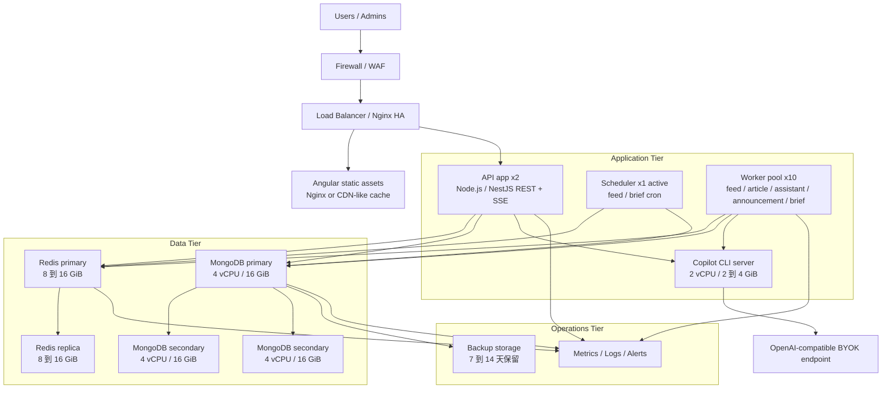

### 講稿內容

這一頁我們看地端正式環境的目標架構。可以先把它分成四層：入口層、應用層、資料層，以及觀測與備份層。

入口層負責接外部流量，通常會有 Firewall、WAF、Load Balancer 或 Nginx HA。應用層放 API app、scheduler、worker pool 和 Copilot CLI server。資料層放 Redis HA 和 MongoDB replica set。最後，觀測與備份層負責 metrics、logs、alerts 和備份保存。

這樣拆分的目的，是不要讓 10 個 worker、Redis、MongoDB 和 Copilot CLI 全部在同一台機器上互相搶資源。API 和 worker 會同時連 Redis、MongoDB 和 Copilot CLI；Copilot CLI 又會連到外部的 BYOK LLM endpoint。只要其中一個環節被打滿，整個 ingestion 或助手評估流程就可能變慢。

所以如果地端環境要達到正式 SLA，建議不要只做單機放大，而是把資料層和 LLM runtime endpoint 獨立出來，並加上健康檢查、監控和替換策略。這樣維護或故障時，才不會一個服務出問題就拖垮整體流程。

---

## 9. 地端硬體資源配置建議

### 投影片重點

### 單機正式起步，成本優先

| 元件 | 建議規格 |
|---|---:|
| 主機，最低可用 | 16 vCPU / 64 GiB RAM |
| 主機，同機保守 | 24 vCPU / 64 GiB RAM，適用 Copilot CLI、MongoDB、Redis 與 10 workers 全部同機 |
| 磁碟 | 1 TB NVMe SSD |
| Worker | 10 containers，每個預留 0.5 到 1 vCPU / 512 MiB 到 1 GiB |
| Copilot CLI server | 預留 2 vCPU / 2 到 4 GiB RAM；若高可用則 2 instances |
| Redis | 預留 8 到 16 GiB RAM |
| MongoDB | 預留 8 到 16 GiB RAM |
| 備份 | 1 到 2 TB 外部或 NAS 備份空間 |

### 高可用正式版，建議目標

| 層級 | 建議規格 |
|---|---|
| App/Worker 節點 | 3 台，每台 8 vCPU / 32 GiB RAM |
| Copilot CLI server | 2 台或 2 replicas，每個 1 到 2 vCPU / 2 GiB RAM，透過 private endpoint 連線 |
| MongoDB replica set | 3 台，每台 4 vCPU / 16 GiB RAM / 500 GB NVMe SSD |
| Redis HA | 2 到 3 台，每台 2 到 4 vCPU / 8 到 16 GiB RAM |
| Load balancer | 2 台小型 VM 或硬體/虛擬 LB |
| Backup | 每日至少一次，保留 7 到 14 天 |

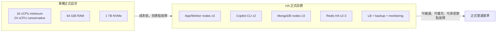

### 講稿內容

這一頁把地端方案拆成兩種來看。第一種是成本優先的單機正式起步，第二種是比較完整的高可用正式版。

如果先以成本優先來做，最低建議是 16 vCPU、64 GiB RAM、1 TB NVMe SSD。這個規格可以承接目前資料量和 10 個 worker 的初始運作，不過它仍然是單機架構，所以要接受單點故障風險。也就是說，這個方案適合快速上線和控成本，但不是最理想的正式 SLA 架構。

如果 Copilot CLI、MongoDB、Redis 和 10 個 worker 全部都放在同一台，那我會建議提高到 24 vCPU、64 GiB RAM。原因是 Copilot CLI 雖然現在 idle 只看到大約 294 MiB，但尖峰時會承擔 session orchestration；Redis 要預留 queue backlog、failed jobs 和 retention 空間；MongoDB 也要保留 index working set。

如果目標是比較穩定的正式營運，建議走高可用版：3 台 App/Worker 節點、2 個 Copilot CLI instances、3 台 MongoDB replica set，以及 2 到 3 台 Redis HA 節點。這樣的好處是服務可以維護、替換、水平擴充，也比較能承受單一節點故障。

---

## 10. 雲端正式環境目標架構

### 投影片重點

雲端建議採 managed data services，應用層容器化，worker 以 10 replicas 為 desired count。

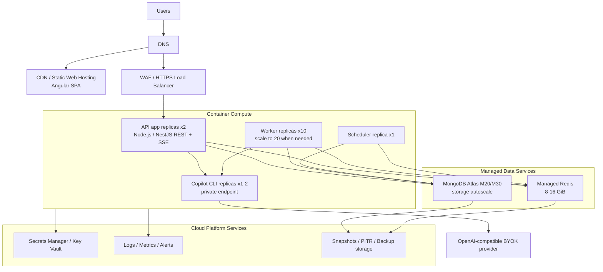

### 講稿內容

這一頁我們看雲端正式環境的目標架構。雲端方案的想法，是把前端、應用層和資料層拆得更清楚，並盡量使用 managed services 降低維運負擔。

Web 前端可以放在 Static Hosting 加 CDN。API 透過 HTTPS Load Balancer 或 WAF 對外服務。應用層則用 container compute 執行 API app、scheduler、worker replicas 和 Copilot CLI replicas。

資料層建議採 managed services。MongoDB 使用 Atlas M20 或 M30 起步，Redis 使用 managed Redis 8 到 16 GiB。Copilot CLI server 則建議做成 private endpoint，只允許 API 和 worker 連進去，不直接對外開放。

雲端方案最大的價值，是把 MongoDB、Redis、備份、監控和一部分高可用責任交給成熟平台處理。這樣工程團隊可以把重點放在應用本身，worker pool 也可以依照 queue depth 做水平擴充，而不是每次都要手動調整主機資源。

---

## 11. 雲端服務選型與資源配置建議

### 投影片重點

| 元件 | 建議規格 |
|---|---|
| Web | Static hosting + CDN |
| API app | 2 replicas，每個 1 到 2 vCPU / 2 到 4 GiB RAM |
| Worker | desired 10 replicas，每個 0.5 到 1 vCPU / 512 MiB 到 1 GiB RAM |
| Scheduler | 1 replica，0.5 到 1 vCPU / 512 MiB 到 1 GiB RAM |
| Copilot CLI server | 1 到 2 replicas，每個 1 到 2 vCPU / 1 到 2 GiB RAM；高可用需 private LB / connection affinity |
| MongoDB | Atlas M20 起步；正式穩定或成長後升 M30 |
| Redis | 8 GiB 起步；若 retention 失效、尖峰 backlog 或需更高安全餘裕，再提高到 16 GiB |
| Backup | MongoDB daily snapshots + PITR；Redis 依 queue 可重建程度決定 |

| 類別 | AWS | Azure | GCP |
|---|---|---|---|
| Container | ECS/Fargate 或 EKS | Container Apps 或 AKS | Cloud Run 或 GKE |
| CDN/WAF | CloudFront + WAF | Front Door + WAF | Cloud CDN + Cloud Armor |
| Redis | ElastiCache Redis | Azure Cache for Redis | Memorystore for Redis |
| MongoDB | MongoDB Atlas on AWS | MongoDB Atlas on Azure | MongoDB Atlas on GCP |
| Secrets | Secrets Manager | Key Vault | Secret Manager |
| Observability | CloudWatch | Azure Monitor | Cloud Monitoring |

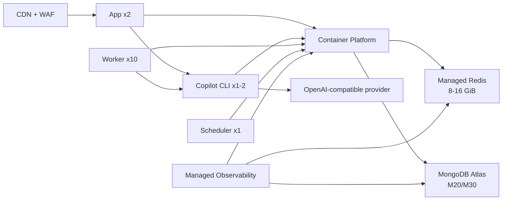

### 講稿內容

這一頁把雲端方案的服務選型和規格整理成表格，方便做採購或平台比較。

Web 層建議用 Static Hosting 搭配 CDN。API app 建議維持 2 個 replicas，這樣其中一個 instance 維護或重啟時，另一個還可以承接流量。worker 則以目前實際使用的 10 replicas 作為 desired count，後續如果 queue depth 或 job duration 上升，可以擴到 20。scheduler 建議維持 1 個 replica，避免同一批排程被重複觸發。

資料服務方面，MongoDB 建議從 Atlas M20 起步，等正式環境穩定或資料量持續成長後，再升到 M30。Redis 在 retention 已經納入控管的前提下，可以先用 8 GiB；如果後續看到尖峰 backlog、failed jobs 快速累積，或安全餘裕不足，再提高到 16 GiB。

Copilot CLI server 建議部署 1 到 2 個 replicas，並放在 private LB 或 private endpoint 後面，只提供給 API 和 worker 使用。第一階段我不建議把 MongoDB 換成相容層資料庫，因為目前系統使用的是 Mongoose 和 MongoDB 的 query/index 語意，Atlas 會是風險最低的雲端路徑。同樣地，也不建議讓 app 或 worker 自己臨時 spawn Copilot CLI，而是用明確的 `COPILOT_CLI_URL` 管理。

---

## 12. 安全控管、備份與災難復原策略

### 投影片重點

以下是地端與雲端都應採用的正式環境共同控制原則；差異在實作工具與責任分工。

| 面向 | 建議 |
|---|---|
| 網路 | Web/API 對外；MongoDB/Redis 僅允許 private network / internal VLAN 存取 |
| Copilot CLI | 僅 private endpoint / internal service；只允許 API/worker 連線 |
| 憑證 | TLS everywhere；秘密值集中於 secrets manager / vault |
| 身分權限 | 最小權限、分角色帳號、資料庫帳號分 app/backup/admin |
| 備份 | MongoDB daily snapshot / dump + restore drill |
| RPO/RTO | 起步 RPO 24h / RTO 4h；正式 HA 可降到 RPO 1h / RTO 1h |
| 稽核 | admin audit、登入、資料異動與 queue failure 保留 |

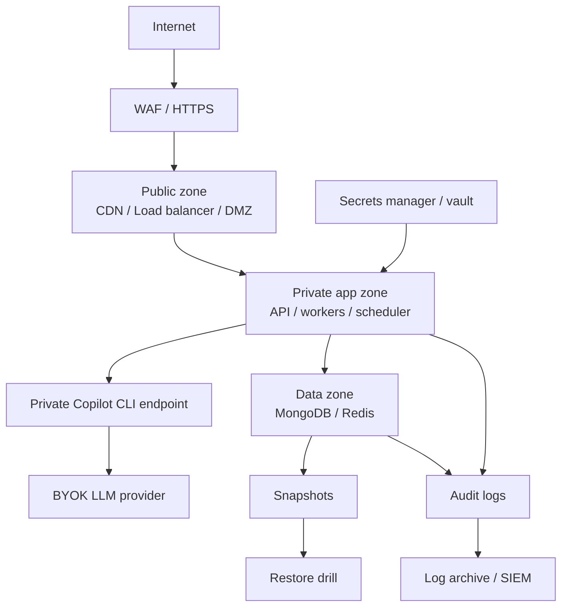

### 講稿內容

這一頁談安全、備份和災難復原。這些原則不管是地端或雲端都一樣，只是實作工具不同。

先看網路安全。正式環境對外應該只暴露 Web、API 或 Load Balancer。MongoDB、Redis 和 Copilot CLI endpoint 都應該放在 private network 裡，只允許 API、worker 和必要的維運節點連線。雲端可以用 VPC、subnet、managed WAF、Secrets Manager 或 Key Vault；地端則可以用防火牆、DMZ、內部 VLAN、反向代理、Vault 或既有密碼管理系統。

再來是秘密值管理。像 Mongo URI、Redis URL、OpenAI API key、Microsoft OAuth credentials，這些都不應該散落在部署腳本或手動指令裡，而是要集中放在 secrets manager 或 vault，並且分角色控管權限。

最後是備份和還原。MongoDB 至少要每日 snapshot 或 dump。雲端可以使用 managed snapshot 或 PITR；地端則需要外部 NAS、備份主機或異地保存。Redis 要不要持久化，可以看 queue 是否能重建，但 queue failure 和重要 operational log 至少要保留。最重要的是，備份不是看到排程成功就結束，還要定期做 restore drill。只有真的演練過還原，RPO 和 RTO 才算是可被驗證的承諾。

---

## 13. 可觀測性、告警與擴充機制

### 投影片重點

以下監控指標同時適用地端與雲端；差異在雲端較容易接 managed metrics 與 autoscaling，地端則需自行建置監控堆疊與擴充流程。

| 類別 | 指標 | 建議告警 |
|---|---|---|
| API | p95 latency、5xx rate、SSE disconnects | p95 > 1s 或 5xx > 1% |
| Worker | queue depth、job duration、failed rate | waiting > 1,000 或 failed rate > 5% |
| Copilot CLI | session latency、active sessions、error rate、container restart | p95 > 2s、error > 1% 或 restart |
| Redis | memory、evictions、ops/sec、latency | memory > 75% 或 evictions > 0 |
| MongoDB | index size、working set、slow queries、connections | slow query 增加或 connections > 80% |
| LLM/API | latency、429/5xx、cost per day | 429 出現或每日成本超標 |
| Storage | DB growth、backup success | backup failed 或 disk > 70% |

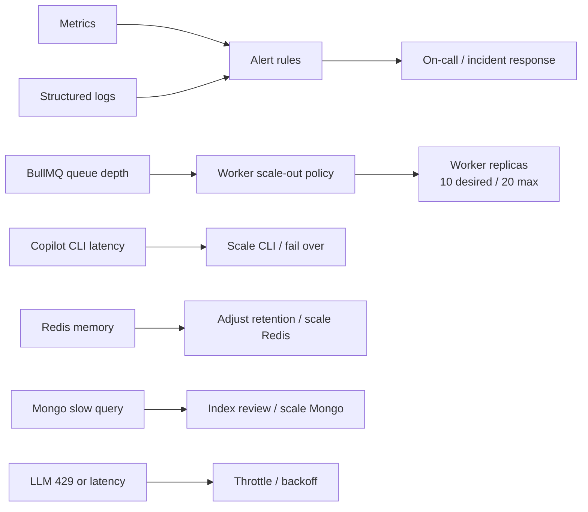

### 講稿內容

這一頁談正式環境上線後要怎麼看狀況。簡單說，我們不能只看 CPU 和 RAM，因為 InfoGather 很多瓶頸其實會出現在 queue、資料庫查詢、Copilot CLI session，或外部 LLM/API rate limit。

API 層要看 p95 latency、5xx rate 和 SSE disconnect。worker 層要看 queue depth、job duration 和 failed rate。Redis 要看 memory、evictions、ops/sec 和 latency。MongoDB 要看 slow queries、connections、index size 和 working set。

另外，Copilot CLI 和 LLM provider 也要納入正式監控。Copilot CLI 要追蹤 session latency、active sessions、error rate 和 container restart。LLM provider 要追蹤 latency、429/5xx，以及每日成本。

這裡的重點是，worker 擴充不能只看 CPU。很多時候 CPU 還沒滿，但 queue depth 已經上升，或 LLM provider 已經開始回 429。雲端可以把 queue depth 接到 autoscaling policy；地端即使沒有自動擴充，也應該定義清楚什麼情況要加 worker、加 Redis、調整 retention，或擴充 MongoDB。實務上，queue depth、job duration、Copilot CLI session latency 和 LLM 429 rate，會比 CPU 更能反映真正瓶頸。

---

## 14. 正式環境建置結論與導入建議

### 投影片重點

本頁收斂前述評估，提出正式環境建置結論、建議方案與分階段導入路線。

**建置結論**

- InfoGather 已具備正式環境規劃基礎，但不可用現行 8 vCPU / 15 GiB 單機直接視為正式規格。
- 正式 sizing 應以 10 個 worker container、MongoDB working set、Redis/BullMQ queue 與 Copilot CLI runtime 共同估算。
- Redis/BullMQ retention 已納入容量控管，後續重點是監控、告警與容量警戒。

**建議方案**

- 地端最低起步：16 vCPU / 64 GiB RAM / 1 TB NVMe。
- 地端全同機保守：24 vCPU / 64 GiB RAM，適用 app、workers、MongoDB、Redis 與 Copilot CLI 全部同機。
- 雲端建議：containerized app/worker/scheduler + managed MongoDB + managed Redis + Copilot CLI private endpoint。

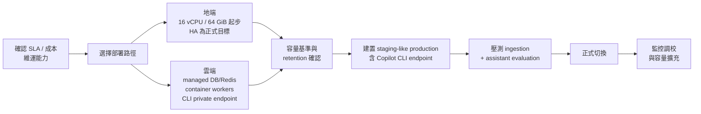

### 建議決策

| 決策項 | 建議 |
|---|---|
| 正式架構首選 | 雲端：managed MongoDB + managed Redis + container app/worker/scheduler + Copilot CLI private endpoint |
| 地端首選 | HA 版：App/Worker 節點 x3、Copilot CLI x2、MongoDB replica set x3、Redis HA x2-3 |
| 成本優先地端 | 單機最低 16 vCPU / 64 GiB / 1 TB NVMe；全同機保守 24 vCPU / 64 GiB，但需接受單點故障 |
| Worker 基準 | 維持 desired 10 replicas；依 queue depth 擴到 20 |
| 立即改善 | BullMQ retention 檢查、Copilot CLI health/session dashboard、queue dashboard |

### 講稿內容

最後這一頁我們收斂成建置建議。整體來看，InfoGather 已經具備正式環境規劃的基礎，但不建議直接沿用目前 8 vCPU、15 GiB RAM 的單機環境作為正式規格。原因是目前已經有 10 個 worker container 在處理背景工作，而且這些 worker 會共同依賴 MongoDB、Redis/BullMQ 和 Copilot CLI server。

如果採地端成本優先方案，最低起步建議是 16 vCPU、64 GiB RAM、1 TB NVMe。這可以作為正式起步，但要接受單點故障。如果 app、workers、MongoDB、Redis 和 Copilot CLI 全部同機，保守建議提高到 24 vCPU、64 GiB RAM。

如果採雲端方案，建議使用 containerized app、worker、scheduler，搭配 managed MongoDB、managed Redis，以及獨立的 Copilot CLI private endpoint。若目標是正式 SLA，我會比較建議優先考慮雲端 managed services，或是地端 HA 架構，而不是長期停留在單機方案。

導入順序可以分四步。第一步，先確認 SLA、RPO/RTO、成本上限，以及到底選地端或雲端。第二步，確認容量基準、BullMQ retention、Redis queue depth 和 failed rate。第三步，建立一個接近正式環境的 staging-like production，而且裡面一定要包含 Copilot CLI endpoint。第四步，做 ingestion 和 assistant evaluation 壓測，確認 10 個 worker 是否足夠、是否需要 max 20，以及 Copilot CLI 的 HA 或 affinity 是否穩定。正式切換後，再依照監控資料持續調整 worker、Redis、MongoDB 和 Copilot CLI 規格。

---

## 附錄 A：資料查詢摘要

### MongoDB

| 指標 | 值 |
|---|---:|
| database | infogather |
| collection count | 29 |
| total documents | 1,113,082 |
| data size | 約 934.84 MiB |
| storage size | 約 540.86 MiB |
| index size | 約 824.84 MiB |
| total physical size | 約 1.36 GiB |

### Top collections

| Collection | Count | Logical data | Index |
|---|---:|---:|---:|
| assistantarticles | 859,775 | 約 416.40 MiB | 約 80.18 MiB |
| articles | 246,876 | 約 512.89 MiB | 約 740.98 MiB |
| notifications | 2,662 | 約 1.66 MiB | 約 0.25 MiB |
| adminaudits | 983 | 約 0.30 MiB | 約 0.06 MiB |

### Redis / BullMQ

| 指標 | 值 |
|---|---:|
| previous observed used memory | 約 3.56 GiB |
| peak memory | 約 3.71 GiB |
| current used memory | 約 34.35 MiB |
| key count | 約 1,502 |
| instantaneous ops/sec | 約 119 |
| waiting / active jobs | 0 / 10 |
| prioritized jobs | assistant 694 |
| completed jobs，主要 queue | assistant 216；article 0；feed 0 |
| failed jobs，主要 queue | assistant 16；article 0；feed 0 |

### Copilot CLI server

| 指標 | 值 |
|---|---:|
| container | `copilot-cli` |
| image | `chunkai1312/copilot-cli:latest` |
| uptime | 約 2 週 |
| current memory | 約 293.7 MiB |
| current CPU | 約 0.01% idle sample |
| integration contract | `COPILOT_CLI_URL` private endpoint |
| production sizing | 1 到 2 replicas，每個 1 到 2 vCPU / 1 到 2 GiB；10 worker 高併發情境建議總預留 2 vCPU / 2 到 4 GiB |

---

## 附錄 B：正式環境規格總表

| 方案 | 適用 | Compute | Data services | 優點 | 注意事項 |
|---|---|---|---|---|---|
| 地端單機正式起步 | 低成本、內部正式 | 最低 16 vCPU / 64 GiB / 1 TB NVMe；全同機保守 24 vCPU / 64 GiB，含 Copilot CLI 2 vCPU / 2 到 4 GiB 預留 | MongoDB + Redis 同機或同虛擬化叢集 | 成本低、導入快 | 單點故障，需強化備份與 CLI 重啟策略 |
| 地端 HA | 對外正式、需維運窗口 | App/Worker x3 nodes + Copilot CLI x2 | MongoDB RS x3 + Redis HA x2-3 | 可維護、可擴充 | 建置與維運複雜度高，CLI 需驗證 affinity |
| 雲端標準 | 最推薦 | API x2、Worker x10、Scheduler x1、Copilot CLI x1-2 | Atlas M20/M30 + Redis 8-16 GiB | 風險低、備份與 HA 成熟 | 月費較高，需控管 LLM/API 與 CLI session 成本 |
